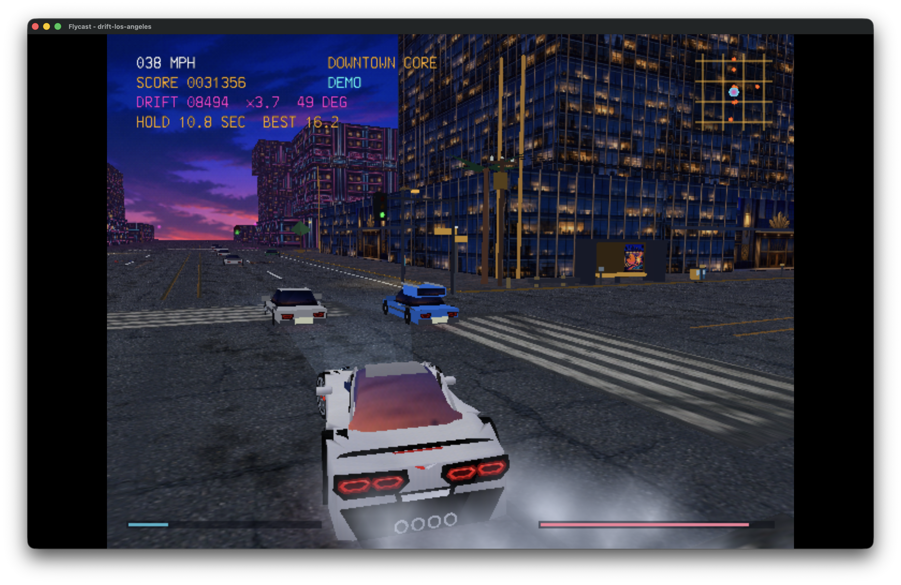
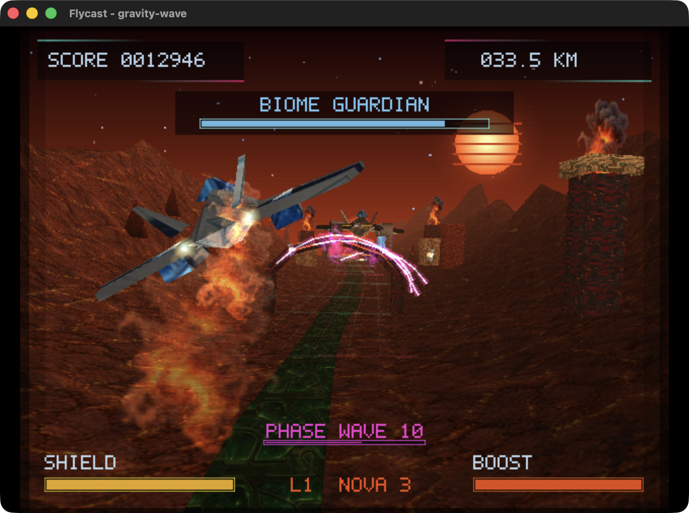
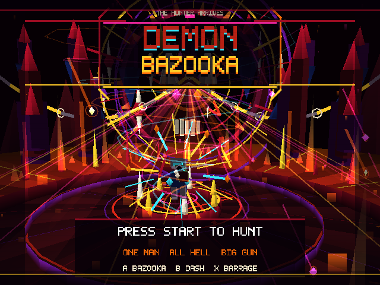
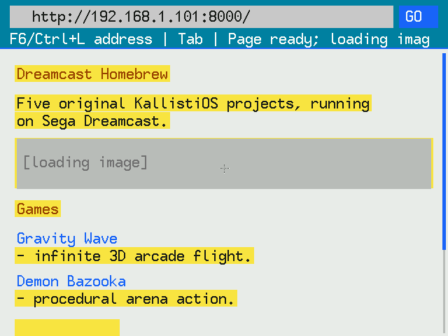
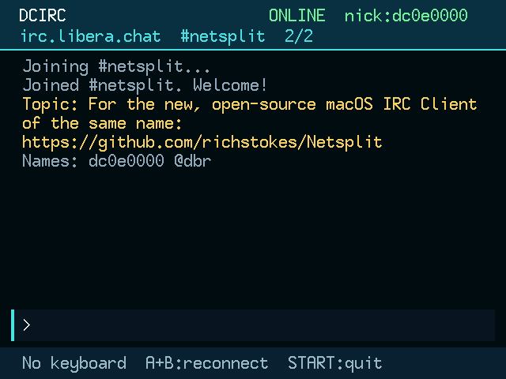
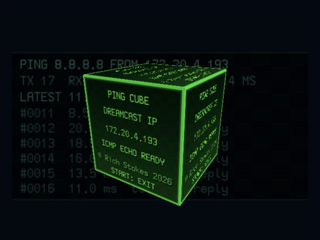

# Dreamcast Homebrew

A collection of original Sega Dreamcast games, network applications, and
technical demos built with [KallistiOS](https://kos-docs.dreamcast.wiki/).
Each project builds as a standalone SH-4 ELF that can boot directly in Flycast
or run on compatible Dreamcast hardware.

## Projects

| Preview | Project | Latest download |
| --- | --- | --- |
|  | **[Drift Los Angeles](projects/drift-los-angeles/)**<br>An open-city arcade street-drifting game with a C7-inspired coupe, four Los Angeles-style districts, traffic, drift chains, dense tire smoke, and recorded V8 audio. | **[CDI](https://github.com/richstokes/dreamcast-homebrew/releases/latest/download/drift-los-angeles.cdi)**<br>[ELF](https://github.com/richstokes/dreamcast-homebrew/releases/latest/download/drift-los-angeles.elf) |
|  | **[Gravity Wave](projects/gravity-wave/)**<br>An infinite 3D arcade flight game featuring four biomes, procedural terrain, enemy formations, guardians, upgrades, and a synthesized soundtrack. | **[CDI](https://github.com/richstokes/dreamcast-homebrew/releases/latest/download/gravity-wave.cdi)**<br>[ELF](https://github.com/richstokes/dreamcast-homebrew/releases/latest/download/gravity-wave.elf) |
|  | **[Demon Bazooka](projects/demon-bazooka/)**<br>A compact 3D arena shooter with rockets, dashes, screen-clearing barrages, escalating demon waves, and runtime-generated visuals and audio. | **[CDI](https://github.com/richstokes/dreamcast-homebrew/releases/latest/download/demon-bazooka.cdi)**<br>[ELF](https://github.com/richstokes/dreamcast-homebrew/releases/latest/download/demon-bazooka.elf) |
|  | **[Dreamcast Browser](projects/dreamcast-browser/)**<br>A deliberately limited HTTPS browser supporting basic text, links, raster images, and Dreamcast keyboard, mouse, and controller input. JavaScript is not executed. | **[CDI](https://github.com/richstokes/dreamcast-homebrew/releases/latest/download/dreamcast-browser.cdi)**<br>[ELF](https://github.com/richstokes/dreamcast-homebrew/releases/latest/download/dreamcast-browser.elf) |
|  | **[Dreamcast IRC](projects/dreamcast-irc/)**<br>A Broadband Adapter IRC client with server and channel pages, fixed-size scrollback, keyboard input, and controller navigation. | **[CDI](https://github.com/richstokes/dreamcast-homebrew/releases/latest/download/dreamcast-irc.cdi)**<br>[ELF](https://github.com/richstokes/dreamcast-homebrew/releases/latest/download/dreamcast-irc.elf) |
|  | **[Ping Cube](projects/ping-cube/)**<br>A networking and PowerVR demo that continuously pings `8.8.8.8`, visualizes latency through the cube's color, and displays live replies, loss, and timing statistics. | **[CDI](https://github.com/richstokes/dreamcast-homebrew/releases/latest/download/ping-cube.cdi)**<br>[ELF](https://github.com/richstokes/dreamcast-homebrew/releases/latest/download/ping-cube.elf) |

Each project directory contains its own controls, dependencies, technical
notes, and verification instructions.

The CDI links are the easiest way to play: download the image and open it in
Flycast, or burn it to CD-R for a Dreamcast that supports MIL-CD. The smaller
ELF downloads are useful for direct emulator boot and development loaders.
[SHA-256 checksums](https://github.com/richstokes/dreamcast-homebrew/releases/latest/download/SHA256SUMS)
are published with every build.

## Building and running

The projects use the KallistiOS SH-4 toolchain. The known-working development
baseline is:

- KallistiOS 2.3.0
- GCC 15.2.0 SH-4 toolchain
- Flycast 2.7

Source the KOS environment, then build a project:

```sh
source "$HOME/.local/share/dreamcast/kos/environ.sh"
make -C projects/drift-los-angeles
```

Launch it directly in Flycast:

```sh
./projects/drift-los-angeles/run-flycast.sh
```

The launchers build by default and accept `KOS_ENV` and `FLYCAST_BIN`
overrides. When the ELF already exists, use `--skip-build` or the project's
`make run` target.

Dreamcast Browser additionally requires the KOS ports for curl, mbedTLS, zlib,
and stb_image. Its [project README](projects/dreamcast-browser/README.md)
documents the included compatibility patch and installation commands. Gravity
Wave's generated texture sources are checked in. Drift Los Angeles likewise
ships its generated PowerVR textures, vehicle mesh, recorded audio, and music
sources; Python, `uv`, Blender, and `afconvert` are needed only when regenerating
those assets.

## License and attribution

The original project code in this repository is available under the
[MIT License](LICENSE).

These projects are powered by
[KallistiOS](https://kos-docs.dreamcast.wiki/), the independent Dreamcast SDK.
KallistiOS is distributed separately under its BSD-like KOS license and
requires attribution.
