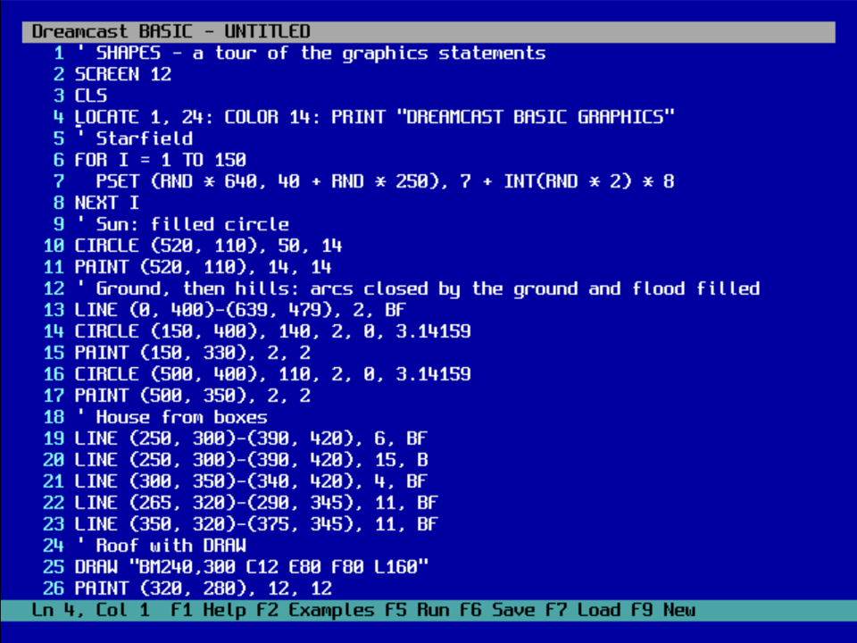
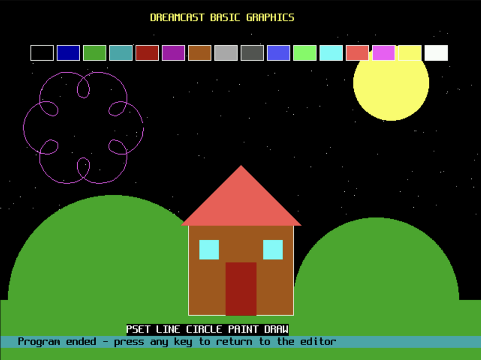

# Dreamcast BASIC



A BASIC programming environment for the Sega Dreamcast and its keyboard: a
full-screen editor, a Microsoft-style interpreter with graphics and sound, and
program storage on the VMU. It is built with
[KallistiOS](https://kos-docs.dreamcast.wiki/).

The interpreter is written for this project rather than ported. Classic
listings assume Microsoft BASIC's dialect - line numbers, `GOSUB`, `ON ...
GOTO`, keywords packed against operands (`FORI=1TO9`) - which the portable
interpreters I looked at (including MY-BASIC) deliberately do not speak. This
one runs the 1970s *BASIC Computer Games* listings unmodified, and adds the
QBasic conveniences: optional line numbers, labels, block `IF`, `DO`/`LOOP`,
`SCREEN 12`/`13` graphics and `PLAY` music.

| | |
| --- | --- |
|  | Output of the bundled `SHAPES` example: `PSET`, `LINE`, `CIRCLE`, `PAINT` and `DRAW` in `SCREEN 12`, finishing with a `PLAY` arpeggio. |

## Using it

Plug a Dreamcast keyboard into any port. Type a program and press **F5**.

| Key | Action |
| --- | --- |
| **F5** | Run the program |
| **F6** | Save to the VMU (asks for a name) |
| **F7** | Load from the VMU (pick from a list, or type a name) |
| F1 | Help |
| F2 | Load one of the bundled examples |
| F3 | Toggle automatic line numbering (on by default) |
| F4 | Renumber the program |
| F9 | New program |
| Esc or Ctrl+C | Stop a running program |
| Ctrl+Y | Delete the current line |
| Arrows, Home, End, PgUp, PgDn, Ctrl+Home/End | Move around |

The bottom status bar shows the cursor's line and column with the function-key
reminders. While a program runs it shows the line being executed (both the
BASIC line number and the editor line), and after an error the editor returns
with the cursor on the offending line. `KEY OFF` hides the bar for full-screen
graphics.

### Line numbers

Line numbers are optional, and the editor provides GW-BASIC's `AUTO` and
`RENUM` as keys rather than commands:

- **Auto numbering (F3).** Press Enter on a numbered line and the next line
  starts with the next number: ten more, or halfway to the following line when
  inserting between two. Typing your own number replaces the suggestion, and
  Enter on a line holding only the suggestion removes it. Unnumbered programs
  are left alone.
- **Renumber (F4).** Renumbers the program 10, 20, 30... in the order shown and
  rewrites every target after `GOTO`, `GOSUB`, `THEN`, `ELSE`, `RESTORE` and in
  `ON ... GOTO` lists, leaving strings, remarks and `DATA` untouched. Targets
  that match no line keep their number and are counted in the status bar.
- A program with **no** line numbers can still `GOTO 3`: the number then means
  the editor line shown in the left margin. F4 turns such a program into a
  conventionally numbered one, converting those targets. Labels (`Top:` ...
  `GOTO Top`) avoid numbers altogether.

Lines run in the order they appear in the editor, not sorted by number.

Each program is its own VMU file, `NAME.BAS` (names are up to eight
characters), with a "BASIC program" description and icon in the Dreamcast file
manager. Saving overwrites the program where it already lives, otherwise it
uses the first VMU found. The text is stored as-is, so a typical listing takes
a handful of blocks; Super Star Trek needs about 42.

Without a keyboard, a controller can still explore: **Y** opens the examples,
the D-pad and **A** choose one, **Start** runs it and **B** stops it.

## The language

Numbers are double precision and print the Microsoft way (`.5`, seven
significant digits); strings hold up to 32,767 characters; arrays have up to
eight dimensions and are created with ten elements per dimension when used
without `DIM`.

- **Program flow:** `GOTO`, `GOSUB`/`RETURN`, `ON x GOTO/GOSUB`, `FOR`/`NEXT`
  (including `NEXT J, I`), `WHILE`/`WEND`, `DO`/`LOOP` with `WHILE`/`UNTIL`,
  `EXIT FOR`/`EXIT DO`, single-line and block `IF`/`ELSEIF`/`ELSE`/`END IF`,
  `END`, `STOP`, `RUN` (restart). Targets are line numbers or `Label:` names;
  in a program with no line numbers at all, `GOTO 1` means the editor's line 1,
  as shown in the left margin.
- **Data:** `LET`, `DIM`, `ERASE`, `CLEAR`, `SWAP`, `DATA`/`READ`/`RESTORE`,
  `DEF FN`, `CONST`, `DEFINT`/`DEFSNG`/`DEFDBL`/`DEFSTR`, `RANDOMIZE`.
- **Text:** `PRINT` with zones, `TAB`, `SPC` and `USING`; `INPUT`,
  `LINE INPUT`, `CLS`, `LOCATE`, `COLOR`, `POS`, `CSRLIN`. The text screen is
  76x27, inset so a television's overscan cannot clip it.
- **Graphics:** `SCREEN` 0, 1, 2, 7, 8, 9, 12 (640x480, 16 colours) and 13
  (320x200, 256 colours, pixel-doubled); `PSET`, `PRESET`, `LINE` with `B`/`BF`,
  `CIRCLE` with arcs and aspect, `PAINT`, `DRAW`, `PALETTE`, `WINDOW`,
  `POINT()`, and `STEP` relative coordinates.
- **Sound:** `PLAY` with the full music macro language (octaves, lengths,
  dotted notes, tempo, `N`, rests, `MN`/`ML`/`MS`, foreground/background),
  `SOUND` and `BEEP`, on a square-wave voice streamed to the AICA.
- **Input:** `INKEY$` (arrow and function keys arrive as the PC's two-byte
  codes), `INPUT$`, `SLEEP`, `TIMER`; `STICK(0..3)` reads the analogue stick
  and D-pad of controller A as 0-255, and `STRIG(0..7)` its A, X, B and Y
  buttons.
- **Functions:** `ABS ATN COS EXP FIX INT LOG RND SGN SIN SQR TAN CINT CLNG`,
  `LEN ASC VAL INSTR CHR$ STR$ LEFT$ RIGHT$ MID$` (also as a statement)
  `STRING$ SPACE$ UCASE$ LCASE$ LTRIM$ RTRIM$ HEX$ OCT$ DATE$ TIME$`.

Not supported: `SUB`/`FUNCTION` procedures, `SELECT CASE`, user types, file
I/O, `GET`/`PUT` sprites and `ON ERROR`. `POKE`, `OUT`, `WAIT`, `WIDTH` and
`VIEW` are accepted and ignored so old listings keep running.

## Bundled examples

Press F2. `STARTREK`, `LUNAR`, `HAMURABI`, `ACEYDUCY`, `BAGELS`, `WORD`,
`MUGWUMP`, `AMAZING`, `LIFE`, `TICTAC`, `BOMBS`, `HILO`, `LOVE` and `SINEWAVE`
are unmodified listings from David Ahl's *BASIC Computer Games*, which he
released into the public domain, as transcribed by the
[basic-computer-games](https://github.com/coding-horror/basic-computer-games)
project. `SHAPES`, `MANDEL`, `PLASMA`, `BOUNCE`, `PADDLE`, `MUSIC` and `MAZE`
were written for this project to exercise graphics, palette animation, sound,
`INKEY$` and the controller.

## Building and running

```sh
source "$HOME/.local/share/dreamcast/kos/environ.sh"
make -C projects/apps/dreamcast-basic
./projects/apps/dreamcast-basic/run-flycast.sh
```

The launcher gives Flycast a keyboard on port B (fed by the host keyboard) and
leaves the controller and its VMU on port A. It accepts `--skip-build` and the
usual `KOS_ENV` and `FLYCAST_BIN` overrides.

## Tests

Everything except [dreamcast-basic.c](dreamcast-basic.c) is portable C, so the
interpreter, screen and editor also build on the host with scripted keys,
virtual time and a directory standing in for the VMU:

```sh
make -C projects/apps/dreamcast-basic/tests check
```

That runs conformance programs for the language, graphics (verified through
`POINT()`), sound (the queued tones are logged) and errors, plays scripted
sessions of the bundled games, and drives the editor through
type/save/new/load/run, auto numbering and renumbering, comparing each transcript with `tests/cases/*.expected`.
`UPDATE=1 tests/run-tests.sh` regenerates the expectations, and
`tests/ppm2png.py` converts the harness's `{SNAP}` screen dumps. CI runs the
suite on every push.

For end-to-end checks on the emulator, test builds load and drive the real
ELF and mirror program output to the serial console:

```sh
make -C projects/apps/dreamcast-basic clean
make -C projects/apps/dreamcast-basic AUTORUN=STARTREK AUTOKEYS=SRS_LRS_
```

`_` is Enter, `@5` is F5 and `@S` a space (see `plat_key`). Run `make clean`
afterwards so the next normal build drops the test hooks.

## Credits

The 8x16 screen font is [Spleen](https://github.com/fcambus/spleen) by Frederic
Cambus, under the BSD 2-Clause license in [LICENSE.spleen](LICENSE.spleen).
