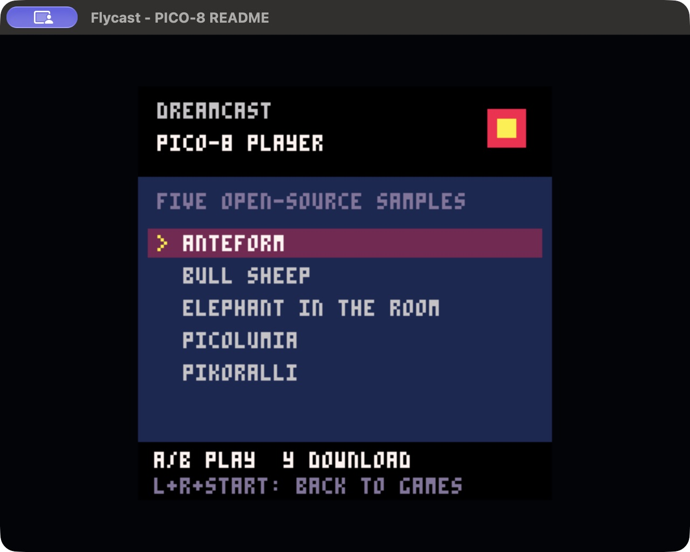
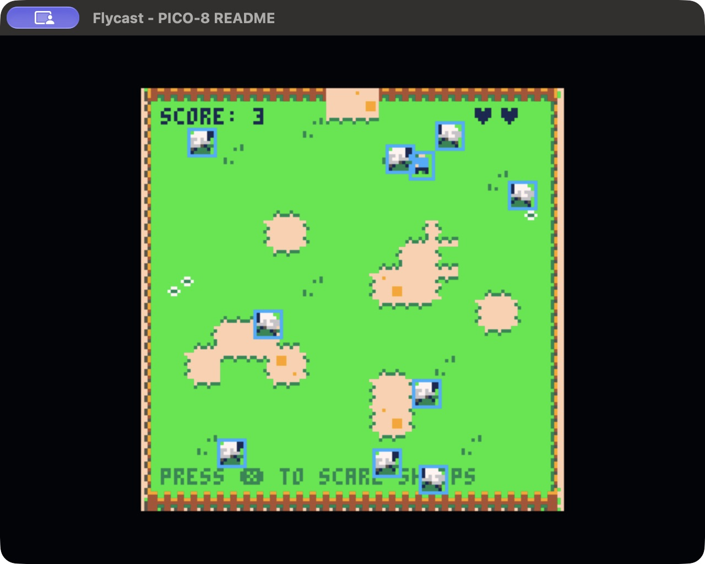
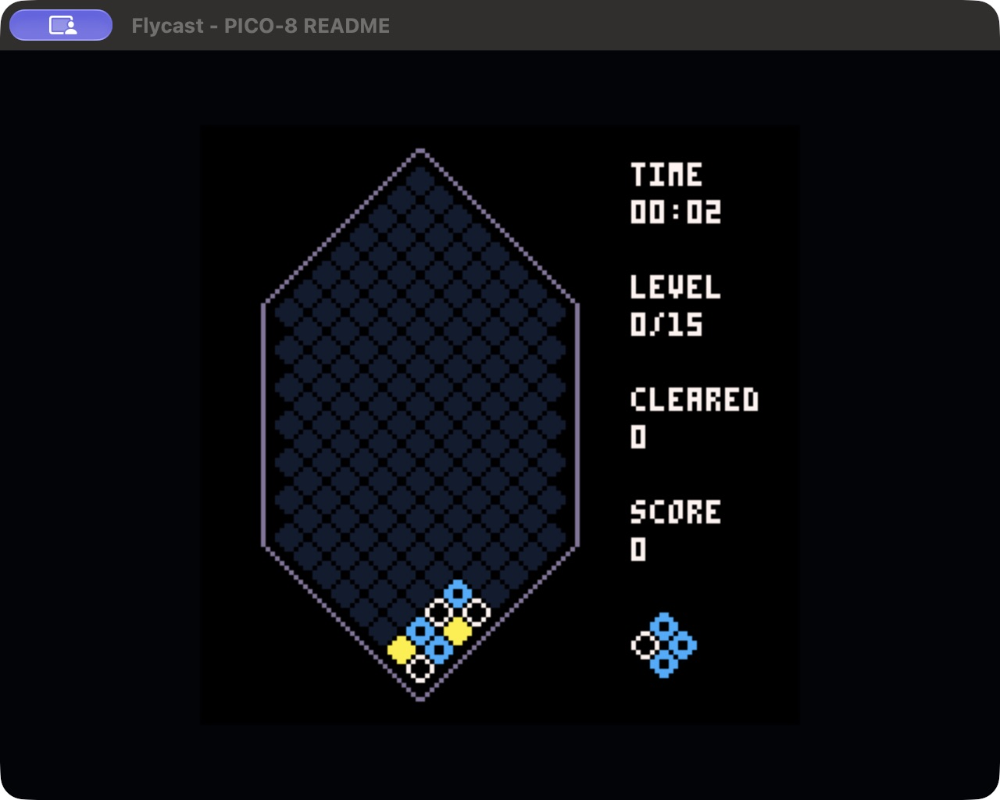
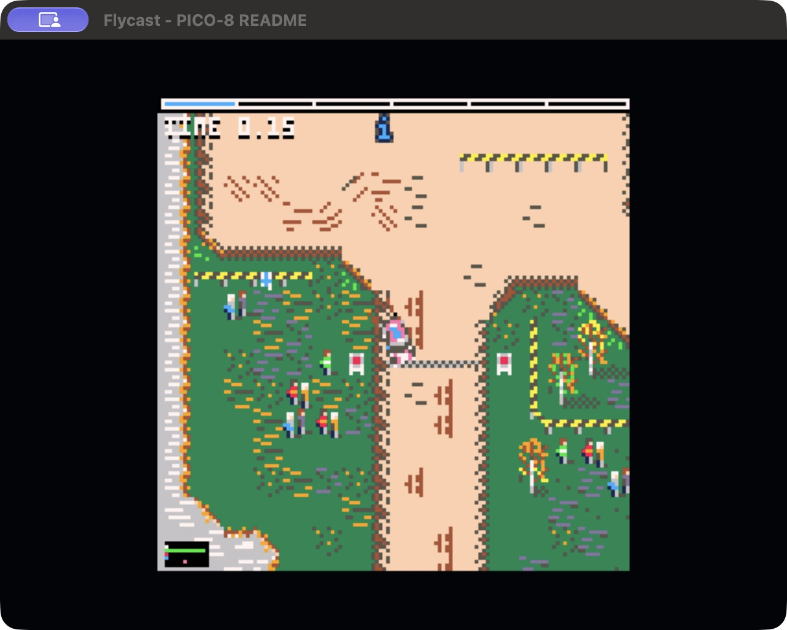

# PICO-8 player for Dreamcast

A KallistiOS port of [FAKE-08](https://github.com/jtothebell/fake-08), with a
controller-driven cartridge picker and five freely licensed games embedded
in the ELF. This interprets actual PICO-8 cartridge code using Z8lua's 16.16
fixed-point numbers and PICO-8 syntax. It is a cartridge runtime, not the
proprietary PICO-8 editor/development environment. It is not affiliated with
Lexaloffle.

## Screenshots

Captured from the Dreamcast build running in Flycast.

| Cartridge picker | Bull Sheep |
| --- | --- |
|  |  |
| **Picolumia** | **Pikoralli** |
|  |  |

## Build and play

```sh
source "$HOME/.local/share/dreamcast/kos/environ.sh"
make -C projects/apps/pico8-dreamcast -j8
./projects/apps/pico8-dreamcast/run-flycast.sh --skip-build
```

Run those commands from the repository root. The launcher builds by default
when `--skip-build` is omitted, resolves absolute paths and respects `KOS_ENV`
and `FLYCAST_BIN`. It uses transient serial-console configuration and requires
no persistent network changes. The runtime and cartridges are checked in;
HTTPS additionally links the `curl` / `mbedtls` kos-ports and KOS's `libppp`.
The baseline is KOS 2.3.0 / SH-4 GCC 15.2.0. Build/link use `kos-c++` and KOS's
`Makefile.rules`; Z8lua's `.c` sources must also compile as C++.
SH4ZAM 0.9.0's C headers are vendored; no separate SH4ZAM install is required.

If needed, install the `mbedtls` and `curl` kos-ports from the sourced environment:
`make -C "$KOS_PORTS/mbedtls" install`, then `make -C "$KOS_PORTS/curl" install`.
The tested versions are Mbed TLS 3.6.6 and curl 8.18.0 with its Mbed TLS backend.
Debug symbols are saved separately under `build/*.elf.debug`; the bootable ELF
has debug sections removed to stay below Flycast's 16 MiB ELF-file limit.
Modem teardown requires the workspace's existing
[KOS PPP lifecycle patch](../../dcvmu.com/client/patches/kos-ppp-lifecycle.patch).
It is already present in the local SDK. For a new SDK checkout, apply that patch
if missing and rebuild `$KOS_BASE/kernel` and `$KOS_BASE/addons/libppp`.
The tested SDK also includes the workspace's
[BBA receive fix](../../dcvmu.com/client/patches/kos-bba-rx-consumer.patch),
[TCP window fix](../../dcvmu.com/client/patches/kos-tcp-upload-window.patch),
[TCP poll-lock fix](../dreamcast-browser/patches/kos-tcp-poll-lock.patch), and
[keyboard attach fix](../dreamcast-browser/patches/kos-keyboard-attach.patch).
The repository CI applies these before building.

## Controls

| Dreamcast control | Action |
| --- | --- |
| D-pad or analog stick | Select a game / PICO-8 directions |
| Left/right in the picker | Show game credits |
| A or X | PICO-8 O button (button 4) / launch selected game |
| B or Y | PICO-8 X button (button 5) / launch selected game |
| Y in the cartridge picker | Open Download & Play |
| Start | Pause/resume; games can provide their own pause-menu items |
| Hold both triggers and press Start | Return to the cartridge picker |

In Flycast, use the keys assigned to these Dreamcast controls in your existing
controller mapping. No persistent input configuration is changed by the launcher.
Missing/disconnected controllers are handled without crashing.

Picolumia starts with **A+B together**. Pikoralli uses left/right to steer,
up/down to accelerate/reverse and A for the handbrake. The other games show
their controls in-game. Anteform's pause menu includes help.

## Bundled games and adding your own

Anteform, Pikoralli, Elephant in the Room, Bull Sheep and Picolumia are bundled.
See [sample selection, sources and licenses](samples/README.md). These were
selected for verifiable MIT/GPL licensing; they are not a global top-five chart.

Copy additional `.p8` or `.p8.png` cartridges into `romdisk/carts/`, then run
`make`. They appear automatically in the picker and become part of the ELF.
Keep any `.p8` `#include` files beside their cartridge in the expected relative
paths. The ROM disk is regenerated when carts are added, changed or removed.
For a disc build, an additional `/carts/`
directory at the CD root is scanned as `/cd/carts/`; real CD/GDEMU loading has
not been tested on hardware. The five built-in games never depend on it.

The ROM disk is mounted read-only at `/rd`. Unknown PNGs are not game cartridges: use PICO-8's cart
PNG format, which carries the code and data inside the image.

## Download & Play

Press **Y in the cartridge picker**, enter an `https://` URL, and press **Start**
to download and launch the game. Use a direct `.p8` or `.p8.png` download link,
such as a GitHub **Raw** link, rather than the game's web page. The file format
is detected from its contents; the URL can contain a query string and need not
end with a cartridge extension.

On the on-screen keyboard, move with the D-pad or stick, press **A** to type,
**X** to toggle case, **Y** to delete, and **L/R** to move the insertion point.
**B** goes back or cancels a transfer. A Dreamcast keyboard can enter the URL
directly; Enter submits, Backspace/Delete edit, arrows move the cursor, and
Escape goes back. The URL editor remembers its text for this session.

The screen shows connection stages, byte progress, and errors. A successful
download starts automatically. The latest downloaded text cart and PNG cart
also appear in the picker, stored in `/ram/download.p8` and
`/ram/download.p8.png`. They disappear when the player quits; no VMU writes
are made. Downloads are limited to 1 MiB and URLs to 1,024 ASCII characters
(use percent encoding for other characters). Text carts must be exported as a
single file; remote `#include` trees are not fetched.

Networking:

- **Broadband Adapter:** KOS initializes Ethernet and DHCP. Downloading waits
  for an address and reports an error when the adapter has no connection.
- **Modem:** when no Ethernet device is present, the download worker dials the
  saved PlanetWeb or DreamPassport ISP profile. If neither has a phone number,
  it uses the KOS DreamPi defaults: `555`, login `dream`, password `cast`.
  Set up the ISP/DreamPi beforehand. The app reads flash settings without
  changing them, and hangs up its own PPP connection after each download.
  Pulse dialing, dial prefixes and AT/pause syntax are unsupported and reported
  instead of silently changing the number.
- **Flycast:** the launcher defaults to `EmulateBBA=yes,DCNet=no`, the local
  outbound proxy. Use `./run-flycast.sh --modem` for its modem PPP peer. This is
  not LAN bridging. No inbound port forwarding is required for ordinary
  downloads.

HTTPS uses TLS 1.2, the bundled Mozilla roots, hostname/chain verification,
and explicit certificate date checks. Set the console's clock correctly;
verification failures cannot be bypassed. Up to five HTTPS redirects are
followed, including relative redirects; HTTP downgrades are rejected. HTTP
chunked responses are supported. This is a direct download client, not Splore
or a web browser: login pages, cookies, proxies, IPv6-only hosts, and HTML game
pages are unsupported.

Transfers have a 90-second connection / low-speed timeout and a ten-minute
overall limit. Downloads are paced to at most 64 KiB/s to bound receive bursts.
Cancellation keeps the screen responsive, but KOS's blocking DNS, modem dial,
and PPP calls must return before cancellation completes. No network worker is
killed while holding SDK locks. There is no automatic dialing on app startup.

## Runtime support and limits

- PICO-8 Lua dialect through Z8lua, drawing primitives, sprites/maps, palettes,
  camera/clip, memory operations and the upstream FAKE-08 APIs.
- 128x128 RGB565 texture rendered through PowerVR at a centered 3x integer
  scale on a 640x480 output. No smoothing is applied.
- Four-channel PICO-8 music/SFX synthesis, mixed to 22,050 Hz mono PCM for AICA.
  The host polls audio on the VM thread, avoiding races with cart resets.
- A 60 Hz VM tick target; the core schedules `_update` at 30 Hz and
  `_update60` at 60 Hz. This is a target, not a guarantee: demanding carts
  slow down on the 200 MHz SH-4. See the measured smoke-test timings in
  [VALIDATION.md](VALIDATION.md).
- `cartdata`/`dget`/`dset` persist across cartridge switches **for this session
  only** (up to 32 keys). There is no VMU persistence; quitting loses saves.
- One controller/player. Mouse, in-game keyboard text input, screenshots,
  external file writes and save states are not implemented by this host.
- Compatibility inherits FAKE-08's limitations. A passing short smoke test
  does not certify an entire game or compatibility with every PICO-8 version.
  Bad-cart/runtime errors return to the picker and are reported on serial.

## Verification

The repository release workflow builds and validates this project's SH-4 ELF
and packages its CDI using [.github/console-projects.txt](../../../.github/console-projects.txt).
CI also verifies the bundled cartridge hashes, source files, and license notices.
Flycast runtime tests below are run locally.

```sh
source "$HOME/.local/share/dreamcast/kos/environ.sh"
cd projects/apps/pico8-dreamcast
file pico8-dreamcast.elf
sh-elf-readelf -h pico8-dreamcast.elf
uv run tests/check_samples.py
uv run tests/run_smoke.py
uv run tests/run_network.py
uv run tests/run_network.py --modem
```

The smoke runner builds a separate `pico8-smoke.elf`, boots it in Flycast and
checks serial results. It exercises 360 VM ticks for each game with scripted
input, checks framebuffer changes, reports audio sample counts and timings,
tests fixed-point arithmetic/graphics/memory/cartdata, and drives the real
picker and pause/resume path. It stops only the Flycast process it starts.
Use `--timeout 300 --log /tmp/pico8-smoke.log` to customize it. It needs a
desktop session; it is not a headless unit test.

For visual inspection, `./run-flycast.sh --smoke-test` leaves test execution
visible. Use `make clean` to remove generated objects and ELF/ROM-disk outputs.
Normal `make` never enables scripted controls.

## Performance and profiling

The Dreamcast build optimizes the Lua dispatch loop after fixing its signed
wraparound checks, converts two RGB565 pixels per store, and uses packed sprite
and patterned-shape rasterizers. Unchanged frames retain the displayed PowerVR
image while VM/input/audio processing continues. Palette, transform and scale
changes force a redraw, as does returning from a modal screen.

[SH4ZAM](https://sh4zam.com/) supplies SH-4 truncation for oscillator phases.
Audio also caches exact note frequencies/rates and per-buffer metadata. These
changes preserve the reference PCM hashes; PICO-8's fixed-point math remains
exact and global fast-math is disabled. AICA uses 1,024-sample refills to reduce
individual synthesis stalls. Heavy scenes can still miss audio deadlines.
See [before/after measurements and remaining limits](VALIDATION.md#sh4-optimization-results).

```sh
# From this project directory, with KOS sourced:
uv run tests/run_smoke.py --kernels   # Rendering and exact PCM regressions
uv run tests/run_smoke.py --profile --log build/profile.log
uv run tests/analyze_profile.py build/profile.log --elf pico8-profile.elf
```

The separate profile ELF samples the active player's program counter from the
KOS scheduler (100 Hz in the tested SDK), using 16-byte buckets. Its report
attributes samples to symbols; inlining, bucket boundaries and scheduler timing
make it statistical rather than an exact cycle count. Keep the matching ELF
with each log and analyze it before rebuilding. The ordinary smoke ELF reports
elapsed guest time, VM/video/audio time, submitted frames, and median/95th/max
tick duration without the PC sampler. VM ticks are not game FPS: `_update`
cartridges run game logic every other tick. Normal release builds contain no
sampler or scripted test loop.

## Network regression tests

The network suite creates short-lived TLS servers on the Mac, with generated
test certificates trusted **only in its separate test ELF**. It tests real
socket/TLS transfers, both cart formats and launch, redirects/chunked encoding,
certificate failures, malformed/oversized/truncated responses, cancellation,
and URL-screen entry. It checks 360 idle launcher frames and the raw Y-button
mapping, including held-button suppression and normal in-game behavior.
It also downloads the pinned Bull Sheep cart from GitHub.
Use `--host <Mac IPv4>` when automatic route detection picks the wrong interface,
or `--no-public` to omit the internet fixture. Tests stop only the Flycast process
they launch and remove their generated private keys.

The Dreamcast host/launcher use the repository's MIT license. See
[runtime provenance and local patches](third_party/README.md) and the
individual [game license notices](licenses/). Full license notices are also
embedded in the ELF's ROM disk at `/rd/NOTICE.txt`; HTTPS dependency notices
are included under `/rd/certs/`.
