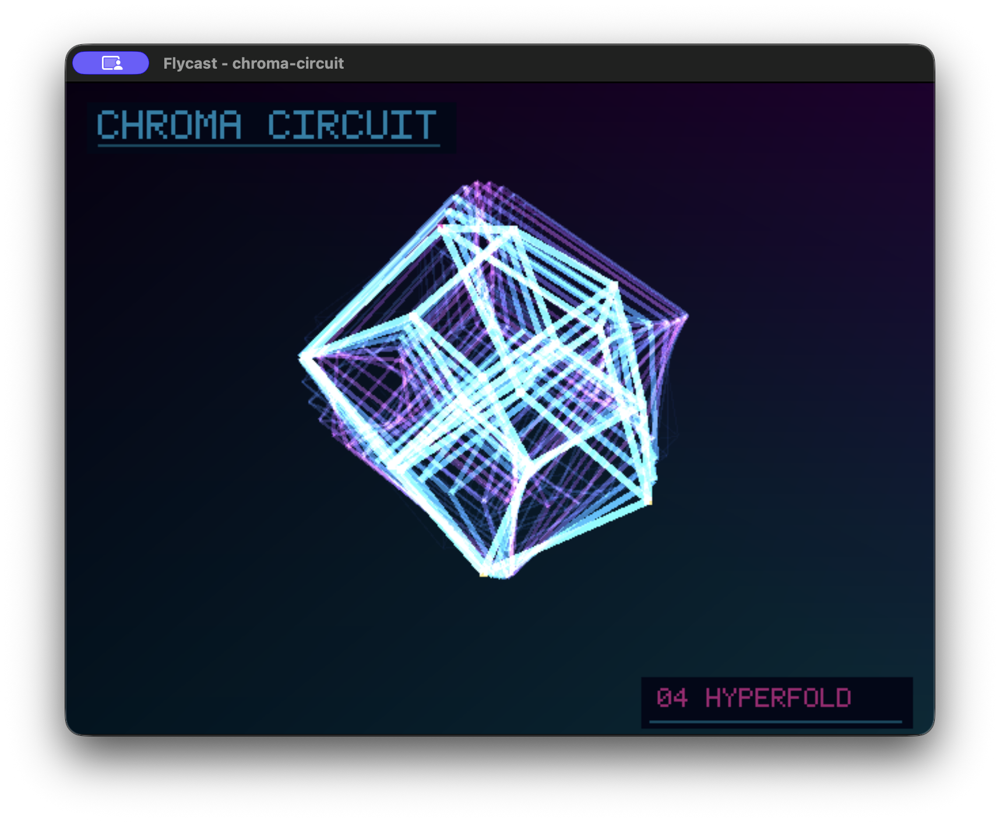

# Chroma Circuit



Chroma Circuit is a standalone Dreamcast demoscene effect written entirely in
SH-4 assembly. It does not link KallistiOS, a C runtime, libc, libgcc, or any
other library. The executable enters at `0x8c010000` and drives the Dreamcast's
video, PowerVR2 tile accelerator, Yamaha AICA synthesizer, Holly event
registers, SH-4 store queues, SCIF serial port, caches, and FPU directly.

The demo is a 5,376-frame, seven-act camera sequence rather than a fixed-view
object spin. At Dreamcast's 59.9453 Hz refresh rate the complete loop lasts
about 89.68 seconds; each act gets 768 frames and the cuts are masked by a short
additive white-energy flash.

1. **Orbit Core** - the shot holds a wide, elevated view for two seconds, then
   cosine-eases from radius 8.6 to 3.2 in a 128-frame plunge. The camera then
   accelerates through almost two close major-axis laps while a second phase
   climbs, dives, and banks it through nearly three corkscrew loops. Equator
   crossings skim 0.87 world units above the torus surface; the intervening
   4.2-radius crests restore a readable full-ring silhouette. The torus facets
   are world-locked so their parallax proves that the lens—not the object—is
   orbiting. A translucent helicoid threads through the ring while two
   independently counter-rotating octahedral energy cores pulse inside it.
2. **Neon Vault** - the camera races down a curved, rolling octagonal nave made
   from 18 runtime-generated cross-sections. Broken stained-glass wall bays,
   emissive arches, longitudinal rails, and recursively nested gates turn the
   PowerVR2 into a moving piece of impossible architecture. The nearest ring
   continually opens onto the next one, so the scene never reads as a flat
   tunnel texture.
3. **Chaos Bloom** - a live Lorenz system feeds a 512-sample circular history
   buffer. Two crossed luminous ribbons trace the strange attractor while 64
   paired shards flare along its age gradient. The parameters breathe and new
   simulation points are integrated every rendered frame, so this is evolving
   geometry rather than a prerecorded butterfly mesh.
4. **Hyperfold** - sixteen vertices of a real four-dimensional hypercube rotate
   independently through its XW, YZ, XY, and ZW planes before a live 4D-to-3D
   perspective divide and the ordinary 3D camera projection. Twelve
   phase-delayed copies become cyan/violet geometric time ghosts; all 32 edges
   are expanded into luminous screen-space beams and the current slice carries
   16 hot nodes. A bar-synchronized fourth-dimensional eye distance repeatedly
   folds the nested cubes inside-out while the camera orbits and banks around
   the result.
5. **Strange Form** - gapped annular bands break dark metallic panels into
   cyan/green rim beams around a faceted core. Procedural radial filaments,
   crossed shards, and speed streaks explode and reassemble through the
   structure while an additive flare burns at its center. A dedicated camera
   eases inward, then accelerates into a steeply rolled near-surface orbit;
   crushed green and steel replace the common neon palette, with letterbox
   bars and scanlines giving the act its own severe visual grammar. The effect
   is analytical geometry with no textures or copied assets.
6. **Machine Dream** - a bronze perforated generator rotates inside nested
   gimbal rings before the camera commits to a fast industrial-cage
   fly-through. The machinery then opens into a high-key steel funnel with
   radial light shafts and finally becomes an amber mesh-orb tower against a
   desolate horizon. Each phase changes geometry, palette, and camera language;
   the entire homage remains original textureless geometry generated by SH-4.
7. **High Country** - a terrain-following camera emerges through white cloud,
   dives into a procedurally ridged blue-gray gorge, attacks a dark knife-edge
   pass, and finally climbs above a thawing green-gold panorama. The forward
   heightfield is rebuilt and projected every frame; depth fog, cold ambient
   rock, warm low-sun highlights, cloud strata, halo geometry, restrained
   handheld roll, and a reflective alpine waterline evoke photographed scale
   without textures or prerecorded camera data.

An original 42-bar score follows the same seven-act timeline. Orbit Core begins
with a restrained F-sharp-minor add9 pad, brings in the pulse and drums as the
camera dives, and accents the close surface skim. Neon Vault opens into the
wide hook; Chaos Bloom fractures it into a bridge. Hyperfold answers with a
six-bar geometric drop. Strange Form follows with an original six-bar
industrial drum-and-bass coda: interlocked 3-3-2 percussion suggests 168.6 BPM
over the unchanged 112.40 BPM tracker clock, while octave-dropped bass,
tritone and flat-nine pressure, close-detuned alarm tones, and three
crash-marked ignitions dismantle the earlier synthwave resolution. Machine
Dream then snaps into a period-appropriate four-on-the-floor generator-trance
movement with wide beat-synchronized panning and an original rising progression
that resolves into High Country. The seventh act releases that pressure into a
broad suspended-minor air pad, open-fifth bass, slow panoramic stereo drift,
restrained half-time percussion, and a large octave arrival over the final
ridge before the dominant cadence resolves cleanly back to Orbit Core.

The busiest act, Chaos Bloom, submits 2,172 world-space triangles per frame:
2,044 from its two ribbons and 128 from the crossed shards. Neon Vault submits
860 world-space triangles, while Orbit Core submits 718. Hyperfold submits 768
beam triangles and 32 node triangles after computing 192 four-dimensional
vertex transforms per frame. Strange Form submits 1,776 triangles including
its generated backdrop, masks, and framing but excluding the shared title HUD
and transition flash. Machine Dream stays deliberately lean at exactly 924
triangles and 1,880 native vertex blocks despite changing its full
composition four times. Torus, helicoid, vault, attractor, hypercube,
fracture-engine, and generator-cathedral geometry are generated or updated by
SH-4 assembly at runtime; camera transforms, reciprocal-Z projection, color
selection, and PowerVR submission also happen per vertex. No transformed mesh
table is stored in the ELF.

High Country rebuilds a 625-point procedural terrain lattice every frame and
peaks at 1,336 triangles / 1,627 native parameter blocks before the shared HUD
and transition. Even its worst complete transition frame is only 2,142
triangles / 3,240 blocks, or 103,680 bytes—about 19.8% of the 512 KiB TA vertex
buffer—leaving generous headroom for real-hardware submission.

## Demoscene inspiration

Hyperfold is an original effect built from the visual vocabulary of the
2000-2004 PC scene rather than a reproduction of one production. Contemporary
demos increasingly made the polygon their primary primitive and commonly used
3D flybys, tunnels, particles, interference, ribbons, blur, and continuous
procedural transformation. In particular, Kewlers' 2002
[Variform](https://www.pouet.net/prod.php?which=7138) is remembered for
interference and glitter, Farbrausch's 2002
[fr-019: poemtoahorse](https://www.pouet.net/prod.php?which=5569) for generated
organic/faceted forms inside 64 KiB, and ASD's 2003
[Dreamchild](https://www.pouet.net/prod.php?which=10530) for transformations
that flow instead of merely cutting. The implementation translates those
principles to Dreamcast-native strengths: tiny topology, analytical motion,
additive geometry, and a deterministic music timeline.

Strange Form draws on the construction vocabulary of Conspiracy's 2006
*Chaos Theory* without reproducing its shots, copy, assets, source, or
soundtrack. Zoom's contemporary [creator making-of](https://www.scene.hu/2006/11/16/chaos-theory-egy-64k-intro-szuletese/)
describes dense transformed clones of simple planes, a tornado-like structure
made from displaced and cloned tori, grazing-angle highlights, grouped
particles, and a deliberate calm-space fake-out before aggressive music-led
motion. Chroma Circuit translates those principles into textureless Dreamcast
geometry: deformed annular bands, silhouette beams, deterministic
particle-like filaments and shards, a cold green/steel palette, and a rolled
camera that attacks the structure at close range. The [official minisite](https://chaostheory.conspiracy.hu/about.php)
documents the original real-time 64 KiB production, and Conspiracy later
published its historical tools and code in an [official source archive](https://github.com/ConspiracyHu/2012SourcePack).

Machine Dream is an original tribute to Farbrausch's 2000 64 KiB intro
[*fr-08: .the .product*](https://demozoo.org/productions/10103/), not a port or
shot-for-shot recreation. The contemporary [Hugi making-of](https://hugi.scene.org/online/hugi22/adfr08.htm)
describes an entirely generated texture/model pipeline, fly-by choreography,
and a conscious move from uniform technical scenes toward a wider variety of
impressions. The surviving [video capture](https://www.youtube.com/watch?v=Y3n3c_8Nn2Y)
shows the visual language translated here: bronze orbital machinery, cages and
grates, white metallic funnels, sparse machine horizons, embedded technical
copy, and long committed camera moves. Chroma Circuit recreates that mood with
its own analytical geometry, colors, timing, and AICA score; it includes none
of Farbrausch's assets, source, text, or music.

High Country is an original Dreamcast interpretation of RGBA and TBC's 2009
4 KiB intro [*Elevated*](https://demozoo.org/productions/102/), not a port or
shot recreation. The [original NFO](https://www.pouet.net/prod_nfo.php?which=52938)
and Iñigo Quilez's [creator seminar](https://iquilezles.org/articles/function2009/function2009.pdf)
explain how a low-density displaced mesh, derivative-shaped procedural noise,
terrain-following camera paths, slope/season materials, inexpensive broad
shadows, fog, sunward scattering, and deliberate film damage created its epic
photographed-landscape feeling. The project's
[released source](https://github.com/in4k/rgba_tbc_elevated_source) confirms
those principles, while the [preserved capture](https://www.youtube.com/watch?v=pI2R-35tPy0)
shows the long arc from blown-out snow through dark ridges to green-gold thaw.
Chroma Circuit translates that grammar into its own textureless SH-4 terrain,
geometry haze, palette, choreography, and AICA composition; no original mesh,
shader, timeline, source code, text, or music is included.

## Build

The Makefile invokes the installed Dreamcast cross-binutils directly. Do not
source the KOS environment; no KOS build rule or compiler wrapper is used.

```sh
cd projects/chroma-circuit
make
make verify
```

`make verify` prints the file type and ELF/program headers, verifies `_start`,
and rejects undefined symbols. A valid result is a 32-bit little-endian Renesas
SH ELF with `_start` at `0x8c010000` and a load segment beginning there.

To use a different cross-binutils installation, override `TOOLCHAIN`:

```sh
make TOOLCHAIN=/absolute/path/to/sh-elf/bin
```

## Run in Flycast

```sh
./run-flycast.sh
```

Or, after an existing build:

```sh
./run-flycast.sh --skip-build
```

The launcher uses an absolute ELF path, enables Flycast's serial console and
vertical sync, disables duplicate-frame presentation, and forces both manual
and automatic frame skipping off. It also detects Flycast 2.7's intermittent
macOS dynarec address-reservation assertion and retries a fresh process rather
than misreporting that host-emulator failure as a guest crash. In its default
`auto` input mode it assigns SDL joystick zero only when macOS reports a USB
HID joystick/gamepad; otherwise port A is bound exclusively to Flycast's
keyboard mapping. The selection is launch-time only and does not alter saved
Flycast preferences. Use `--input gamepad`, `--input keyboard`, or the
`CHROMA_CIRCUIT_INPUT` environment variable for an explicit override. A
successful boot prints:

```text
CHROMA CIRCUIT // bare SH-4 entry
MAPLE: direct A0 DMA, LEFT/RIGHT scene select
AICA: thirteen-slot raw synthwave / DnB / trance / ambient tracker online at 112.40 BPM
PVR2: direct registers, tile matrix, no SDK runtime
TA: seven-act orbit + vault + chaos + hyperfold + strange form + machine dream + high country online
```

The demo runs continuously with a controller optional. Press **D-pad Left** or
**D-pad Right** to jump immediately to the previous or next act; the selection
wraps at either end. Flycast's default keyboard mapping uses the **Left Arrow**
and **Right Arrow** keys. Every act identifies itself in the bottom-right
plaque as `01 ORBIT CORE`, `02 NEON VAULT`, `03 CHAOS BLOOM`,
`04 HYPERFOLD`, `05 STRANGE FORM`, `06 MACHINE DREAM`, or
`07 HIGH COUNTRY`. Manual jumps land just beyond the transition flash so the
new title and scene are visible immediately; the tracker cuts old drum tails
and revoices the destination harmony on that same complete frame. Close
Flycast, or press Control-C in the launching terminal, to stop it.

## Raw AICA soundtrack

Dreamcast does not contain a General MIDI sound set or ROM instrument bank.
Its MIDI registers are serial I/O, while the Yamaha AICA itself is a 64-slot
PCM/ADPCM wavetable synthesizer. Chroma Circuit implements the period-correct
equivalent of a tracker/module player directly in SH-4 assembly:

- Five signed, zero-DC, 32-sample PCM8 oscillator waves occupy only 160 bytes
  at sound-RAM offset `0x30000`. No prerecorded song or streamed mix is hidden
  in the executable.
- Thirteen autonomous hardware slots provide a rounded digital arpeggio,
  doubled pulse lead, true low pulse bass, four-note stereo pad, delayed saw
  tap, re-keyed triangle kick, gated noise snare with a tonal body, and separate
  hat/crash noise.
- AICA's own pitch LFO supplies slow, different-rate drift to the pad and a
  subtle chorus offset to the doubled lead. The effect continues in hardware
  without consuming SH-4 transform time.
- One tracker tick equals one displayed frame. Eight ticks make a row, four
  rows make a beat, and the base tempo is 112.40 BPM. Six 16-row bars fit each
  768-frame scene exactly, for 42 bars and 672 rows per loop.
- The ARM7 remains in reset: SH-4 uploads the oscillator waves over G2, starts
  the complete voice bank with one `KYONEX`, then writes only pitch, pan, and
  total-level registers. A two-execute key-off/key-on sequence gives the kick
  a deterministic zero-phase attack while already-running voices continue.
- Every G2 transaction is 32-bit and uses a bounded FIFO drain. Waveform
  readback gates startup, and a 600-frame serial counter verifies both tracker
  row cadence and live slot-zero sample-position changes.

This is real AICA synthesis on Dreamcast hardware, not host MIDI playback, an
emulator audio trick, KOS's sound server, or a software PCM mixer.

## Low-level rendering path

- Detects VGA versus standard A/V cable pins and programs 640x480 timings.
- Enables and invalidates the SH-4 instruction and operand caches through P2.
- Builds a raw port-A Maple `GETCOND` DMA descriptor, reads controller replies
  through an uncached P2 alias, validates response/function words, converts the
  active-low button mask, and edge-detects Left/Right without KOS. The command
  table and 1 KiB response area are isolated on 32-byte cache lines.
- Runs the Maple pipe asynchronously twice per rendered frame for quick taps:
  no controller wait can stall the renderer. A bounded four-frame recovery
  path safely re-arms a missing or wedged device.
- Creates two native PVR tile matrices, opaque/translucent object pointer
  buffers, 512 KiB vertex regions, and RGB565 framebuffers in VRAM. Fifteen
  complete OPB overflow banks per set consume otherwise idle texture space so
  lens-filling triangles cannot evict the vector HUD from a hot 32x32 tile.
- Streams 32-byte polygon and vertex parameter blocks through store queue zero.
- Polls TA list-complete, ISP render-complete, and scanline hardware status,
  then flips the framebuffer at the vertical refresh boundary.
- Bounds every hardware wait and reports TA, render, or scanline failures over
  SCIF before halting, so a malformed PVR transaction is not a silent freeze.
- Uses reciprocal-Z depth testing for solid geometry and ONE/ONE blending for
  the helicoid, dual crystal core, star tunnel, grid, orbital markers, vault
  light structures, Lorenz ribbons, shards, Hyperfold beams/nodes, Strange
  Form rim beams, filaments, shards, streaks and core flare, Machine Dream
  portal wires, gimbal highlights, light shafts and flare, and the scene-change
  flash. The depth buffer makes intersecting layers disappear
  behind and re-emerge in front of one another without CPU-side triangle
  sorting.
- Builds a shared spherical-orbit camera once per frame. A staged hold/dive
  timeline feeds a close Lissajous rail with independent yaw, pitch, roll, and
  second-harmonic dolly motion. Radius minima coincide with zero pitch, so the
  close beats actually cross the torus equator instead of missing it above or
  below, while every submitted world vertex retains positive camera-space Z.
- Builds the vault's 18 seam-closed octagonal rings into a compact per-frame
  cache, then reuses them across wall, arch, rail, and recursive-gate passes.
- Advances a nonlinear Lorenz integrator continuously during Chaos Bloom and
  projects its 512-point history through a dedicated analytic orbit camera.
- Rotates a unit hypercube through four independent 4D planes, performs a
  fourth-dimensional perspective divide, projects 12 delayed copies through a
  live 3D camera, and expands their 384 edges into constant-width screen-space
  beams with SH-4's reciprocal-square-root instruction.
- Builds Strange Form from gapped annular panel bands, radial filaments,
  crossed screen-space shards, outward speed streaks, and a faceted core, then
  drives them through a dedicated easing/orbit camera with a steep live roll.
- Projects Machine Dream's nine moving portals, sixteen cage rails, and three
  independent gimbals once per frame into a compact 5.23 KiB cache, then reuses
  those points for opaque metal and additive highlight passes while its camera
  flies continuously through four lighting and architectural phases.
- Rebuilds High Country's 25x25 analytical ridge field into a 7.40 KiB
  projected cache every frame. The camera samples the same centerline height,
  banks with its lateral path, and keeps all 625 points between 1.8 and 29.4
  camera-space units before the opaque terrain is dressed with geometry fog,
  ridge glints, sun rays, lens ghosts, and a near-frame vignette.
- Uses TMU1 as a free-running hardware timer and prints a 600-frame cadence
  report over SCIF. The counter is re-primed after serial output so diagnostics
  cannot contaminate the next measurement window.

The checked-out KOS headers and implementation were used only as a local
register-level reference. No KOS object, header, startup routine, or API is
part of the build.

The assembly routines use a deliberately private register convention tuned for
the closed demo call graph. They are not drop-in SH ELF ABI functions without
adding the usual callee-save wrappers.

## Tested configuration

Tested by direct ELF boot in Flycast 2.7 with its Vulkan renderer and default
keyboard-to-port-A controller mapping. The serial startup completed without a
panic or missing resource; a diagnostic run received 600 valid Maple replies
in 600 frames with zero malformed replies and zero DMA timeouts. Orbit Core was
also rendered in assembly-time visual-QA builds frozen at local frames 96, 184,
248, 269, 291, and 333 to inspect the wide view, dive, skim, bank, crest, and
second skim independently. Those builds freeze only the timeline and preserve
normal framebuffer alternation; saved captures were decoded at pixel level so
desktop preview/differential-capture artifacts could not masquerade as missing
HUD geometry. The closest and most overlap-heavy frames were also used to size
the TA overflow area conservatively for real hardware. Strange Form was
independently frozen at local frames 64, 160, 288, 448, and 640 to inspect its
reveal, approach, silver-white ignition, close bank, and copper reassembly.
Machine Dream was frozen at local frames 96, 288, 480, and 672 to inspect its
bronze generator, cage flight, steel funnel, and amber machine horizon. High
Country was frozen at local frames 96, 288, 480, and 672 to inspect the cold
ravine, snowfield, lifted gold panorama, and thawed valley, then booted from
local frame 32 with the timeline running to verify continuous terrain flow,
bank, and weather cuts. All seven acts, their named bottom-right plaques, and
their transitions remained stable through an uninterrupted full 5,376-frame
loop, and both framebuffer sets rendered correctly. Nine consecutive
600-frame windows—including the final twice-per-frame input sampler—reported
zero missed vertical blanks and
`0x077516c4` or `0x077516e0` TMU1 ticks, within 28 ticks (about 2.3
microseconds total) of Flycast's theoretical 600-refresh interval at 59.9453
Hz. The launcher transiently forces vertical sync on, duplicate-frame
presentation off, and both
manual and automatic frame skipping off, keeping presentation centered around
60 fps without depending on saved Flycast preferences. The code includes VGA
and 480i timing paths intended for real hardware, but it has not yet been
exercised on a physical Dreamcast.

The final soundtrack was also captured from Flycast's actual paced SDL AICA
output as 44.1 kHz signed 16-bit stereo for 97.64 seconds, comfortably longer
than the complete 89.68-second seven-act song loop. The capture had no clipped
or near-clipped samples, 0.210% zero-valued samples, negligible DC offset
(0.47 and 0.64 sample units), and a peak of -12.76 dBFS. Per-act stereo RMS
remained controlled: -31.12 dBFS for Orbit Core, -30.35 for Neon Vault, -30.18
for Chaos Bloom, -28.73 for Hyperfold's intentional lift, -30.78 for Strange
Form's percussion-led industrial coda, -29.91 for Machine Dream's
generator-trance movement, and -30.59 for High Country's open-air coda. The
same run reported `0x4b` or `0x4c` decoded rows per 600-frame window while the
renderer continued to report zero missed vertical blanks.

Generated `.o`, `.elf`, and screenshot files are intentionally ignored. Use
`make clean` to remove build products.
