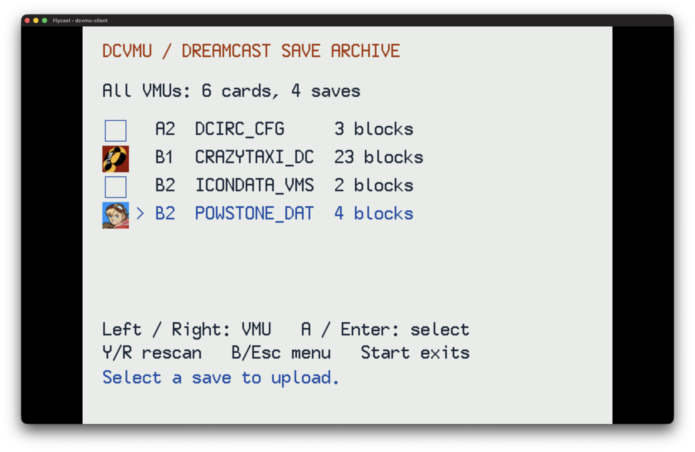

# DCVMU Dreamcast client

A KallistiOS application that uploads and downloads VMU data saves with [dcvmu.com](https://dcvmu.com).
Register on the website, then log in here with the same username and password.
Requires a broadband adapter **or a Dreamcast modem with a working DreamPi setup**,
and a controller or Dreamcast keyboard. Uploading reads the source save without changing it. Downloads write to a
chosen VMU only after confirmation. The client also writes
its own one-block `DCVMU_AUTH` login save.



## Build and run

Uses the installed KOS 2.3 toolchain and kos-ports curl, mbedTLS and zlib. The
browser project's README documents the local ports compatibility patch.

Apply this project's KOS networking fixes before linking, if not already applied:

```sh
source /Users/rich/.local/share/dreamcast/kos/environ.sh
git -C "$KOS_BASE" apply /Users/rich/Dropbox/code/dreamcast-dev/projects/dcvmu.com/client/patches/kos-bba-rx-consumer.patch
git -C "$KOS_BASE" apply /Users/rich/Dropbox/code/dreamcast-dev/projects/dcvmu.com/client/patches/kos-tcp-upload-window.patch
git -C "$KOS_BASE" apply /Users/rich/Dropbox/code/dreamcast-dev/projects/dcvmu.com/client/patches/kos-ppp-lifecycle.patch
make -C "$KOS_BASE/kernel" -j4
make -C "$KOS_BASE/addons/libppp" -j4
```

The first patch serializes the BBA polling/worker receive consumers. The second
handles TCP window updates and preserves transmitted sequence numbers during
retransmission; see [RFC 9293 section 3.10.7.4](https://www.rfc-editor.org/rfc/rfc9293.html#section-3.10.7.4). These are portable SDK fixes, not changes to the
service protocol. They are already applied to the SDK used for this build.
Rebuild dependent ELFs after changing the SDK; existing binaries stay unchanged.

The PPP patch initializes TCP/IP even when no Ethernet device is present,
stops and joins the PPP receive worker before hanging up/freeing its buffers,
clears the departed default interface and ISP credentials, and bounds stalled
modem writes while propagating transmit errors. It is required for modem builds.
CI already applies all `patches/kos-*.patch` files before building KOS, including
`libppp`; no emulator-only modem code is linked into the client.

```sh
source /Users/rich/.local/share/dreamcast/kos/environ.sh
make -C /Users/rich/Dropbox/code/dreamcast-dev/projects/dcvmu.com/client
file /Users/rich/Dropbox/code/dreamcast-dev/projects/dcvmu.com/client/dcvmu-client.elf
sh-elf-readelf -h /Users/rich/Dropbox/code/dreamcast-dev/projects/dcvmu.com/client/dcvmu-client.elf
/Users/rich/Dropbox/code/dreamcast-dev/projects/dcvmu.com/client/run-flycast.sh --skip-build
```

The launcher transiently enables the BBA using Flycast's `DCNet=no` picoTCP
outbound proxy, attaches controllers/VMUs on ports A-C and a keyboard on
port D, routes the Mac keyboard to that port, and enables serial diagnostics.
Click the Flycast window to focus it, then use arrows/Tab to navigate and Enter
to edit a field before typing. This is not LAN bridging. Set `KOS_ENV`
or `FLYCAST_BIN` to override the installed tools. The [native Flycast build](../../../tools/flycast/README.md)
fixes macOS startup crashes without Rosetta. No persistent emulator or network
settings are changed. Crash-report uploading is disabled for this
credential-handling application.

CI publishes [CDI disc images](https://github.com/richstokes/dreamcast-homebrew/releases/latest/download/dcvmu-client.cdi)
and [ELFs](https://github.com/richstokes/dreamcast-homebrew/releases/latest/download/dcvmu-client.elf),
linked from the site's account page. It can also boot
with a compatible real-Dreamcast homebrew loader; real hardware has not been
verified. CI packages a self-booting CDI using mkdcdisc; local `make` builds the ELF.

## Controls

- D-pad up/down / keyboard up/down: choose a field or save. Tab advances fields.
- Left/right on the save list: cycle all cards, A1, A2, and other attached VMUs.
  The heading shows the selected card and number of saves, including empty cards.
- A / Enter: edit, select, or confirm. Y / R rescans the VMUs on the save list.
- Text editing: type with a keyboard, or choose characters on the on-screen
  keyboard with the D-pad and A. X erases, Y finishes, B cancels. Keyboard
  Enter/Tab finishes; Escape cancels editing.
- Visibility starts **public**. Toggle it to **private** before uploading if
  only your account should see or download that save.
- Existing backups: the client matches the original VMU filename and shows a
  seven-row paginated picker. A/Enter selects a backup, then confirms replacement;
  X/N keeps a new copy. B returns without replacing anything. Replacement uses
  the chosen save ID and revision, preserves its title, and applies the upload's
  notes and visibility. Title collisions on new copies receive a number.
- My saves: X/N opens Rename for the selected cloud save. Edit **Save title**,
  then select **Save title** to commit; B cancels. Public saves cannot be renamed.
- B / Escape / Backspace returns to the previous page (Escape exits at login/main menu).
- Start exits, retaining a remembered login. Exiting shows a thank-you screen
  after cleanup; it stays visible until you power off/reset the Dreamcast or
  close the emulator. Escape at login/main menu uses the same exit screen.
- X / L at the main menu signs out, revokes the token and removes its VMU save.
- B / Escape cancels an active network transfer. A failed or canceled request
  may already have reached the server; check your account before retrying.

The upload picker, upload details and download list show the save's embedded
32x32 colour icon (first animation frame). Missing or malformed icons use an
outline marker. Upload icons are read from the VMU; download icons use authenticated
HTTPS byte-range requests for just the 640-byte header and first frame. Icons are
cached only for the current page and refreshed when loading another page or scope.
B/Esc cancels icon loading while leaving the list available. If a preview request
fails, remaining icons use placeholders; selecting a save still downloads and
verifies the complete file before offering installation.

Save title is editable (up to 64 characters), initially prefilled with the VMU
filename so typing is optional. Game and the original VMU filename are read-only.
The upload screen previews the embedded game description; the service supplies
catalog names for known filenames and decoded descriptions for unknown files.
Titles label cloud entries and never change the VMU filename or save bytes.
Notes and public/private visibility are also editable. The upload is the complete
padded raw VMS file.
VMU mini-games (directory type `0xcc`) and empty entries are not listed.

## Network and credentials

### Modem / DreamPi

BBA/LAN adapters detected by KOS take priority. Only when there is no default
network interface does the client initialize the modem, dial, and negotiate
PPP (the dial-up IP connection). A BBA connection failure does not trigger
modem probing. The existing BBA receive worker and HTTPS timeouts stay the same.

Set up and test DreamPi with another application first. DCVMU reads the primary
phone number, PPP username/password, blind-dial setting and optional DNS from
the console's saved **PlanetWeb** profile, falling back to **DreamPassport**.
It uses the first profile with a nonempty primary phone number; it never mixes
credentials from different profiles. If neither has a usable profile, it uses
the KOS DreamPi example's `555` number, `dream` username and `cast` password.
Missing username/password fields also use those defaults. ISP credentials are
separate from your dcvmu.com account login and are not printed to the console.
DNS normally comes from PPP negotiation; saved ISP DNS is a fallback.

The other app's live connection does not carry over: DCVMU must dial again on
each boot. It does **not** configure DreamPi, write console flash, import VMU
browser settings, or interpret modem AT initialization strings. KOS uses DTMF
tone dialing; pulse dialing and dial strings with pauses/waits are rejected.
Spaces, hyphens, parentheses and periods in the number are ignored. The saved
primary number's area code is prepended when requested. Outside-line,
call-waiting and long-distance prefixes are not used; configure the direct
DreamPi number. If both browsers have profiles, update PlanetWeb's first.

Startup shows detection, dialing (up to 65 seconds for KOS's dial-tone/carrier
waits), and PPP negotiation. B/Esc/Start requests cancellation; it takes effect
after the current SDK call returns. Failures show a connection-specific error;
restart to dial again. Exit hangs up and releases PPP. A dropped connection is
not automatically redialed or used to retry uploads.

Modem HTTPS requests allow 60 seconds to connect and five minutes overall;
icon previews allow 90 seconds overall. The 128 KiB save-size limit and all
certificate, hostname, download-length and SHA-256 checks remain in place.

API references: [KOS PPP](https://kos-docs.dreamcast.wiki/group__networking__ppp.html),
[KOS modem](https://kos-docs.dreamcast.wiki/group__modem.html), and the installed
`$KOS_BASE/examples/dreamcast/modem/ppp/ppp.c` DreamPi example. Real modem,
line-voltage and DreamPi hardware validation is still required before calling
this hardware-verified.

### HTTPS

Every request uses HTTPS with hostname and CA verification, TLS 1.2 or newer,
and the bundled Mozilla trust store. No insecure HTTP fallback exists. Keep
the Dreamcast clock correct and update `romdisk/cacert.pem` alongside the
browser's CA bundle when needed. Uploads open a fresh HTTPS connection after
menu interaction; other requests can reuse connections. The client polls BBA
receive traffic in a KOS worker to avoid Flycast's IRQ re-entry bug.
Requests are bounded by time and response size; cancellation
remains available during transfers.

For intermittent upload timeouts in Flycast, install the current
[native Flycast build](../../../tools/flycast/README.md#tcp-upload-fix).
Flycast 2.7's picoTCP proxy can acknowledge an upload but leave its bytes
queued instead of forwarding them to the HTTPS server. The local build fixes
that asynchronous read/write stall; changing the ELF or raising its timeout
alone cannot fix it. A synthetic local HTTPS regression test is documented
with the emulator patch.

Passwords stay in RAM and are cleared after login. A random, revocable token and
username are stored in the one-block `DCVMU_AUTH` save on an available VMU.
The client restores and validates it at startup, showing **Attempting auto login...**
instead of the login form while checking the saved session. Success opens the
main menu directly; a failed attempt returns to the login form with an error.
Remembered sessions expire 90 days after login. If no VMU has space, login still works for the current run
and the client reports that remembering failed. Keep the same VMU attached on
subsequent runs. Offline restore failures preserve the save for a later retry;
expired/revoked tokens require a new login.

Anyone with this VMU login save can access the account until the token expires
or is revoked. It is not encrypted with an embedded/recoverable application key.
Passwords are never written. The reserved filename is hidden from the save list;
client and server also reject its signature if renamed. X/L signs out and deletes
the loaded login save. If disconnected, server revocation cannot be guaranteed,
although local deletion is still attempted. Reinsert a removed card to erase it.

The local launcher reserves a persistent A1 card for login, shared across VMU banks.

## Verification

Modem setup/failure checks run as a temporary SH-4 ELF in Flycast, with mocked
flash/modem/PPP responses and real KOS threads and semaphores. They cover saved
profile precedence, defaults, DNS fallback, invalid dial settings, no modem,
PPP initialization/credential setup failures, dial/PPP failures, cancellation,
and idempotent cleanup. They also check that sockets initialize without a BBA:

```sh
python3 projects/dcvmu.com/client/tests/run_modem_checks.py --log-dir /tmp/dcvmu-modem-checks
```

Both HTTPS integration runners accept `--modem` to use Flycast's modem/PPP
emulation with the `DCNet=no` picoTCP proxy; omitting it tests the existing BBA
backend. This is emulator PPP, not a connection through physical DreamPi or LAN
bridging. Both use isolated VMUs, synthetic data and a temporary local HTTPS
server, keeping certificate verification enabled:

```sh
projects/dcvmu.com/service/.venv/bin/python projects/dcvmu.com/client/tests/run_public_browse.py \
  --modem --host <Mac-LAN-IP> --log-dir /tmp/dcvmu-ppp-browse
python3 projects/dcvmu.com/client/tests/run_upload_stress.py \
  --modem --transfers 3 --host <Mac-LAN-IP> --log-dir /tmp/dcvmu-ppp-uploads
```

The public-browse test exercises login, paging, icons, privacy, downloads,
VMU installation/read-back, uploads, conflict handling and renaming. The stress
test defaults to 30 uploads across 4,608, 8,704 and 98,816-byte saves, followed by
a 98,816-byte download with SHA-256 and byte-for-byte checks. `--transfers 3`
tests one upload of each size, useful at modem speeds. Both runners wait for
network shutdown before reporting success.

Verified locally on 2026-09-15: full public-browse integration and the three-size
upload/large-download check passed on both BBA and modem/PPP, including shutdown.
The BBA 30-upload stress check and the modem settings/failure checks also passed.
Earlier BBA runs showed intermittent Flycast/picoTCP and IRQ failures before
passing reruns; these emulator results do not establish real-hardware reliability.
Publish this client release alongside the updated website setup instructions.

The integration build (`CPPFLAGS=-DDCVMU_SELF_TEST`) reads a temporary,
git-ignored `romdisk/test-credentials.txt` containing a disposable test username
and password on separate lines. It exercises login, VMU reading, upload,
conflict, revision-checked private replacement, and keep-both against the real
HTTPS service. Never distribute this build. Remove the credential file and
run `make clean && make` before producing a release.

`tests/fixture.c` creates a synthetic 17-block save. Compile it in an isolated
KOS scratch project, and launch it only with a dedicated temporary
`config:Dreamcast.VMUPath` plus `config:PerGameVmu=no`. It intentionally writes
a test VMU; never point it at personal VMUs. Use the same isolated VMU directory
when launching the integration client, and compare the VMU image SHA-256 before
and after. The production client does not compile the fixture code.

Verified in Flycast 2.7 with its picoTCP BBA backend: website registration and
login, then client login/upload/conflict/private replacement/keep-both for both
17-block (8,704-byte) and 193-block (98,816-byte) saves. Authenticated downloads
matched the fixture bytes; anonymous private downloads returned 404. The source
VMU image SHA-256 stayed unchanged. The large fixture uses
`CPPFLAGS=-DDCVMU_FIXTURE_BYTES=98304`. Automated integration drives the same
application functions; real controller and real hardware testing remains open.

## Upload and download navigation

After manual or remembered login, the main menu offers **Upload a save**,
**Download a save**, **Browse Public Saves**, and **Sign out**. Upload retains the existing VMU picker.
Download opens **My saves**, including private saves.

To get someone else's saves, find them on dcvmu.com first and note the owner's
username. Choose **Browse Public Saves**, enter that exact username (case does
not matter), optionally enter part of a game title, and select **Find saves**.
Both fields support the controller's on-screen keyboard and a Dreamcast keyboard.
Only that account's public saves appear, even when searching your own username.
An unknown username, private-only account, or unmatched game shows an empty list;
B/Esc returns to the populated search form so you can correct it.

Lists show seven saves with icons and game titles per page, newest updates first.
Left/Right changes pages; available directions appear below the list. Y/R refreshes
from page one using the same search. Failed/canceled page requests retain the
previous page, selection and icons. Public browsing requires an owner; there is
no global public-feed toggle. The current 200-save account limit means at most
29 pages per owner, with just one page cached in Dreamcast memory. Changes made
on the website while browsing can shift entries between pages; refresh to restart.

A/Enter downloads the selected entry over HTTPS,
checks its expected length and SHA-256, then opens the destination VMU picker.
Y/R rescans destination cards. No card is written while browsing or downloading.

Choose a card to see the install/replace confirmation, which defaults to Cancel.
Existing saves require explicit replacement. The client checks free blocks,
rechecks the target card and existing save before writing, preserves the original
filename and VMS header offset, then reads back the file to verify its bytes.
Do not remove the VMU or power off during writing. VMU writes are not atomic;
a hardware/write failure can still damage the destination save. Games' save
formats and region compatibility remain the games' responsibility.

## Local Flycast VMUs

Running `run-flycast.sh` discovers all 128 KiB `*vmu*.bin` images in Flycast's
data directory and configured VMU directory. Populated cards are listed first.
It mounts **persistent test copies** so installs and remembered logins survive
restarts while original game VMUs remain unchanged. The copies live under
`~/Library/Application Support/DCVMU/VMUs`. A1 is dedicated to DCVMU login;
A2/B1/B2/C1/C2 hold five discovered images per bank, with a keyboard on port D.
All images remain accessible through numbered banks, including empty ones.

```sh
./projects/dcvmu.com/client/run-flycast.sh --list-vmus
./projects/dcvmu.com/client/run-flycast.sh --bank 1
./projects/dcvmu.com/client/run-flycast.sh --bank 2
```

Close the current test session before opening another bank. `--list-vmus` prints
the original image-to-slot mapping and save filenames. Normal launching prints
the active mapping. `--vmu-image /path/to/card.bin` (repeatable) chooses explicit
images instead of discovery; `--vmus-dir /path` overrides discovery. `--dry-run`
prepares/reports the mapping without launching. All emulator settings are transient; `PerGameVmu=no` lets the
client see the selected cards. This does not merge or expose unlimited physical
VMUs: the Dreamcast still sees only its attached slots.

An original changed by a game gets a new versioned test copy on the next launch;
previous test copies are kept. Installed saves are not copied back to originals
automatically. This prevents a test install from overwriting a game's real save.
On real hardware, insert the destination VMU and choose it in the client.

The read-only `CPPFLAGS=-DDCVMU_VMU_TEST` integration build checks forward and
backward switching among All/A1/A2 with a populated A1 and empty A2. It does
not log in or upload saves. Clean-rebuild without this flag for distribution.

`CPPFLAGS=-DDCVMU_AUTH_TEST` verifies one-block login write/read/filtering on
an isolated VMU; a second boot verifies persistence and deletion. Never run this
fixture against personal VMUs. Clean-rebuild without test flags for release.

`CPPFLAGS=-DDCVMU_DOWNLOAD_TEST` exercises login/menu navigation, private/public
listing and pagination, a large download with SHA-256 validation, installation,
overwrite confirmation/cancellation, nonzero header offsets, and a full card.
It needs a disposable account with eight fixtures (seven public, plus newest
private `DCVMU_TEST` larger than half a VMU), and isolated empty A1/A2 cards.
For a local HTTPS fixture, git-ignored `romdisk/test-service.txt` supplies its
origin and `romdisk/test-ca.pem` its test CA. Certificate verification stays on.
Remove all `romdisk/test-*` files and clean-rebuild before releasing. Launcher
host checks: `python3 -m unittest discover -s projects/dcvmu.com/client/tests`.

The public-browser integration test builds in a temporary directory and runs
the actual local Flask service over verified HTTPS with synthetic accounts and
isolated VMUs. It exercises username editing/canceling, owner privacy, game
filtering, next/previous pages, failed-page recovery, empty results, rejection
of an unfiltered service response, and another user's download/install/read-back.
Run it using the service's Python environment and this Mac's LAN IPv4 address:

```sh
projects/dcvmu.com/service/.venv/bin/python projects/dcvmu.com/client/tests/run_public_browse.py \
  --host 192.168.1.200 --log-dir /tmp/dcvmu-public-browse
```

Deploy the updated service before distributing the new client; public browsing
depends on the API's `user` and `game` filters. Real BBA hardware is unverified.

The isolated public-browse integration test also exercises title editing, rename
cancellation, ID-based replacement after a concurrent rename, Keep both, and
cloud renaming without changing save bytes. Run it with the service virtualenv:

```sh
../service/.venv/bin/python tests/run_public_browse.py --host <Mac-LAN-IP> --log-dir /tmp/dcvmu-title-check
```

This uses temporary synthetic accounts, a local HTTPS service, isolated VMUs,
and Flycast's `DCNet=no` picoTCP backend. It never edits production saves.
Deploy the service before publishing this client version.
