# Drift Los Angeles

Drift Los Angeles is an original open-city street-drifting game built for Sega
Dreamcast with KallistiOS. Drive an original American grand tourer through an
unbounded, deterministic Los Angeles-inspired street grid at blue hour, link
drifts between wide boulevards, and bank increasingly valuable score chains.

The car is an original model influenced by the proportions and angular design
language of the Corvette C7 era: a long hood, fastback glass, rear haunches,
sharp lamps, splitter, diffuser, ducktail, and four separately modeled wheels.
It contains no manufacturer badge or copied production geometry.

## Highlights

- Direct low-level PowerVR rendering through `<dc/pvr.h>` at 640x480
- Separate opaque and translucent polygon lists, reciprocal-Z depth testing,
  bilinear-filtered textures, RGB565 materials, ARGB4444 HUD, and table fog
- Continuously streamed procedural city blocks with wide road corridors,
  downtown towers, low-rise art-deco buildings, glass facades, concrete and
  graffiti surfaces, sunset mountains, palm trees, sidewalks, crosswalks, long
  center stripes, multi-lane dashed dividers, parking edges, and road-edge
  markings
- Near-plane-clipped road and pavement polygons eliminate the missing wedges
  that otherwise appear when a large street tile passes under the chase camera;
  screen-edge primitive rejection, block-frustum culling, and three-range
  vehicle LOD preserve the full visible scene within the frame budget
- Thirty-three resident PVR textures generated from eight original high-resolution
  material atlases, a dedicated painted skyline panorama, and title key art,
  edge-conditioned and
  ordered-dithered for 16-bit output, including 256x256 cracked asphalt and
  paired district façade families, concrete and paver sidewalks, weathered road
  markings, utility covers, repair patches, illuminated storefronts, civic
  furniture, billboards, varied windows, and neon facades
- Stepped block architecture with full street-level podiums, narrower offset
  upper volumes, crowns, gabled warehouses, recessed textured storefront bays,
  façade pilasters, fire escapes, balconies, marquees, parapets, clustered
  rooftop plant, and view-dependent façade culling
- Four persistent, geographically distinct neighborhoods: the tower-filled
  cobalt-and-gold Downtown Core; the low pastel Pacific Coast with a real
  oceanfront boulevard and boardwalk; the brick, mural, container, and
  water-tower Arts Quarter; and the billboard-heavy magenta/cyan Neon Strip
- A signature landmark in every district, colored local street lighting,
  district-specific pavement, curbs, sidewalks and props, entry banners, and a
  color-changing minimap so navigation does not depend on identical blocks
- A clean-sheet Blender-authored C7-inspired car exported as a 1,610-vertex,
  2,954-triangle PowerVR mesh. Its construction follows the supplied
  front/rear/side reference with a low center hood between raised fender crowns,
  rear-set cab-back greenhouse, raked windshield, sunset-reflective fastback
  glass, short rear overhang, and high rear haunches. The lower shell and canopy
  are separate authored volumes rather than one smoothed tubular loft.
- Shallow Boolean wheel openings that preserve the upper fender surfaces; a
  broad faceted prow around a deep trapezoidal grille and restrained corner
  ducts; twisted swept headlamp surfaces carrying detailed PVR projector lenses;
  fender extractors, amber side markers, door cuts and lower creases, compact
  mirrors, paired high-mounted angular taillamps in coherent dark housings, front
  and rear crossed-color badges, recessed plate band, deck-hugging spoiler lip,
  splitter, diffuser, and four individually modeled metallic exhaust outlets
- Four separately modeled 24-sided tires with five-spoke rims, brake rotors,
  hubs, five raised lug nuts and a center cap per wheel, restrained red calipers,
  animated wheel rotation, articulated front steering, door handles, panel
  seams and driver-side fuel filler, pearl-white
  paint with preserved reflection detail, smoked sunset glass, carbon trim, and
  smoothly interpolated generated vertex-normal lighting
- Dynamic single-track tire physics with front/rear slip angles, load-limited
  lateral force, yaw inertia, speed-sensitive steering, progressive rear-grip
  loss and recovery, fast counter-steer response, high-angle yaw stabilization,
  twenty-percent stronger forward drive force for sustained-drift power,
  throttle oversteer, clutch kicks, handbrake initiation, braking, reverse,
  drag, off-road grip, and building impacts
- Thirty-six moving traffic cars with two-way lane discipline, cruising-speed
  variation, traffic-aware spacing and braking, world streaming, player
  avoidance, signal-aware stops, physical impacts, working headlights and
  brake lamps that brighten under deceleration, plus tapered multi-part bodies,
  polygon wheels, denser parked curb traffic, sedan, wagon, crossover,
  street-ute and tall delivery-van silhouettes, and a recurring yellow-cab
  variant with a roof light
- A dense street-life layer with correctly paced animated pedestrians, benches,
  bins, planted street trees, fully textured sidewalk kiosks, cafe tables,
  parking meters, bus shelters, poster panels, hydrants, palms, curb edges,
  crosswalks, direction arrows, grated storm drains, street-name signs,
  newspaper boxes, bike racks, utility poles, transformers and sagging wire
  runs, rooftop HVAC and aerial silhouettes, billboard structures, and
  time-phased traffic signals
- Layered blue-hour lighting with warm streetlamp pools and halos, fading
  storefront spill, neon pavement color, player and traffic headlight cones,
  dynamic red brake-lamp halos and intensity-scaled road pools, emissive signs,
  moving warm/cool body reflections, intermittent high-RPM flame bursts from
  the four center exhausts, and a richly painted parallax skyline behind the
  streamed 3D city
- Drift-angle detection, live unbanked score, a six-times chain multiplier,
  hold timer, best-hold record, 2.5-second duration bonuses, and a 12-second
  on-screen endurance meter
- Progressive V8 throttle delivery with sustained high-angle drift torque,
  roughly 180 mph gearing, throttle-controlled rear slip, lift-off recovery,
  and a high-angle yaw guard that preserves counter-steer authority
- Long-lived continuous twin skid marks and dramatic layered rear-tire smoke
  with bright dense cores, broad soft-edged plumes, turbulent wake motion, and
  density that escalates during sustained drifts, plus speed-widened chase
  cameras, subtle body roll, an MPH speed display, and a traffic-aware
  street-grid minimap
- A compact arcade HUD that keeps the city and car unobstructed while showing
  live drift angle, multiplier, hold time, best chain, score, and district
- A genuinely recorded V8 built as a period-correct idle/drive sample bank and
  played as hardware AICA voices alongside a real tire-squeal recording. RPM is
  damped before two long, stationary recordings crossfade over deliberately
  narrow pitch ranges; circular macro-leveling removes loop-rate pumping and
  conservative bus headroom prevents AICA mix clipping. Gear, throttle, engine
  load, wheel slip, and surface shape the mix while a lighter stereo stream adds
  road, wind, transmission, traffic, impacts, and exhaust pops
- A complete 96-second, 160 BPM stereo racing soundtrack by MintoDog replaces
  the former procedural arpeggio. Its full mastered arrangement is embedded as
  compact 22.05 kHz mu-law, fades smoothly between title/pause/gameplay levels,
  and ducks briefly beneath major tire, impact, and exhaust events so the V8
  and music remain clear without clipping
- A full-screen illustrated title presentation, pause, controller hot-plug
  handling, reset, and clean shutdown

The city is generated from integer block coordinates around the car. That
keeps the visible geometry bounded for real hardware while allowing continuous
driving without a world edge or loading screen.

## Showcase captures

These are direct Flycast captures from the title screen and automated district
tour, running the same PowerVR renderer used during play:

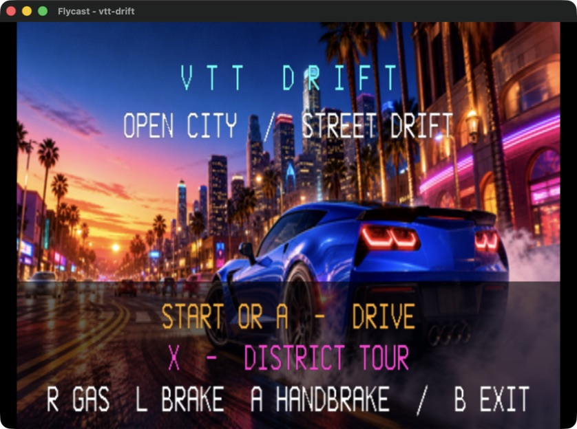

| Downtown Core | Pacific Coast |
| --- | --- |
| 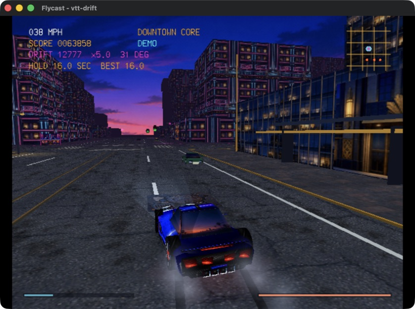 |  |

| Arts Quarter | Neon Strip |
| --- | --- |
| 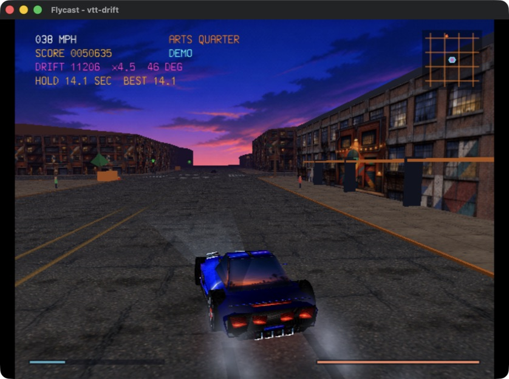 |  |

The latest density/LOD pass adds segmented cornices, deeper awning rows,
projecting shop signs, thirty-six varied traffic vehicles, thicker smoke,
reflective road lighting, and proximity-gated curbside microdetail around the
60 Hz target:

| Pacific Coast traffic and drift smoke | Neon Strip final geometry pass |
| --- | --- |
| 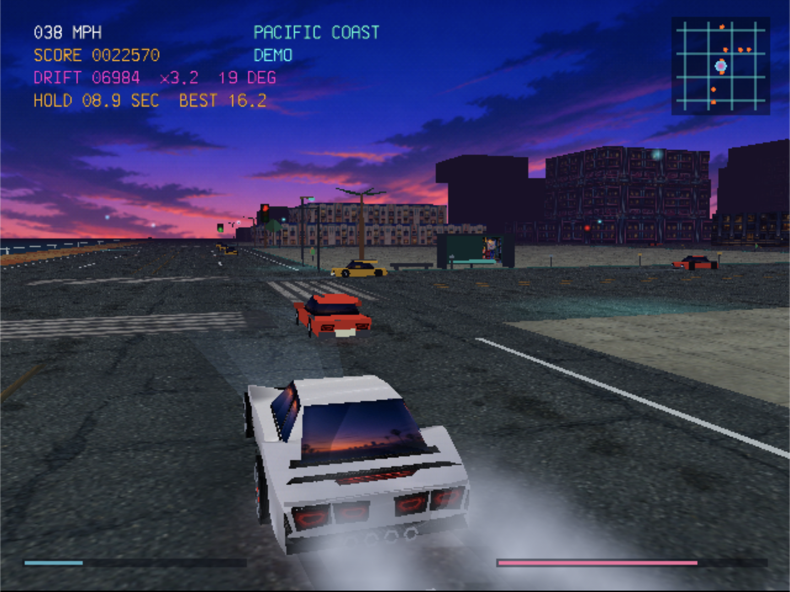 | 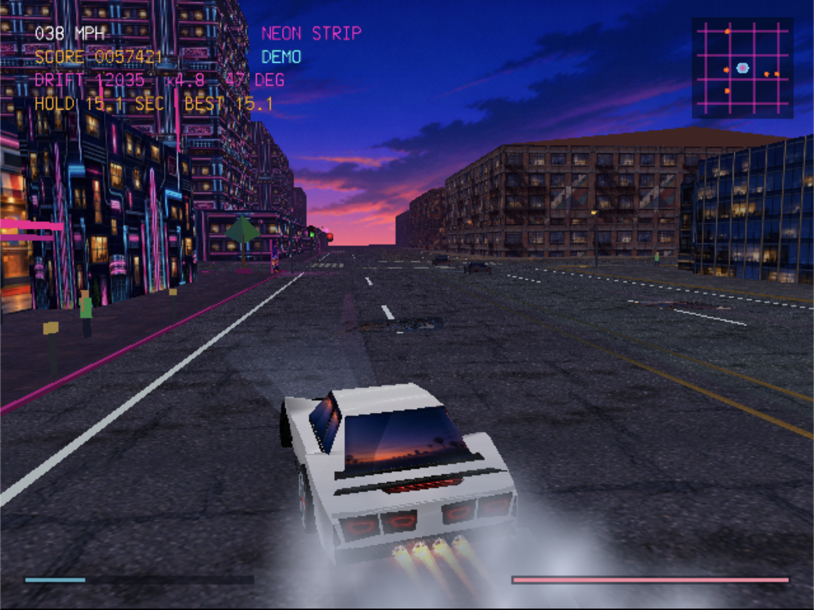 |

The sustained-drift plume and RPM-gated exhaust bursts use the same translucent
PowerVR path as gameplay:

| Layered drift smoke | High-RPM exhaust burst |
| --- | --- |
| 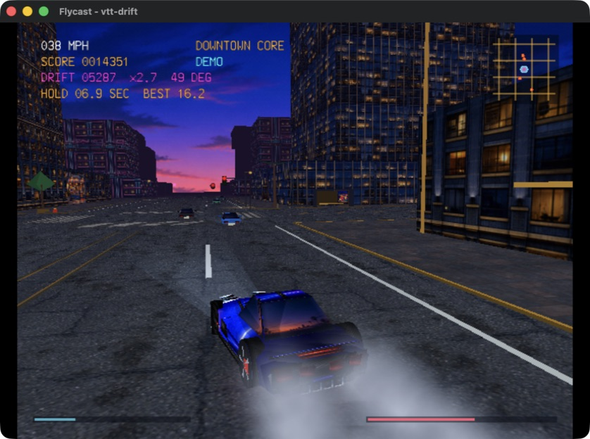 | 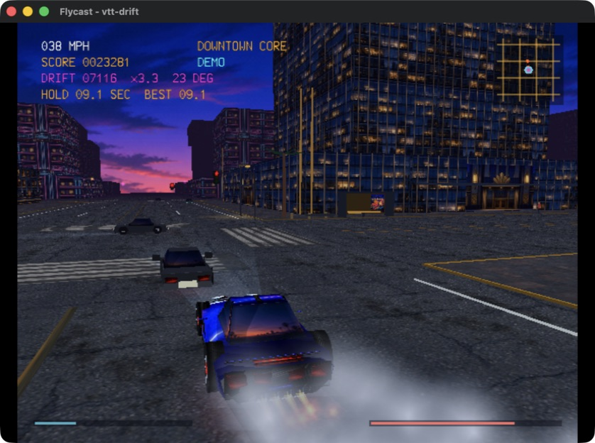 |

The optional clean capture camera makes the rebuilt proportions easier to
inspect without changing the retail chase camera. These are direct PowerVR
captures of the current panel-and-canopy model:

| Straight front | C7-inspired side silhouette | Straight rear |
| --- | --- | --- |
| 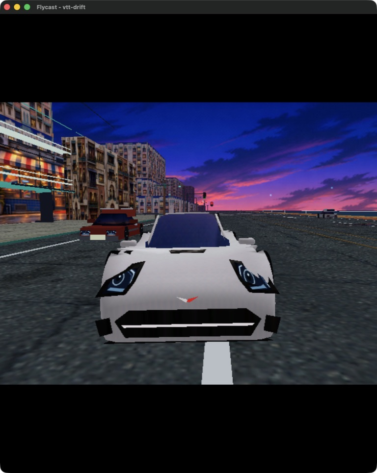 | 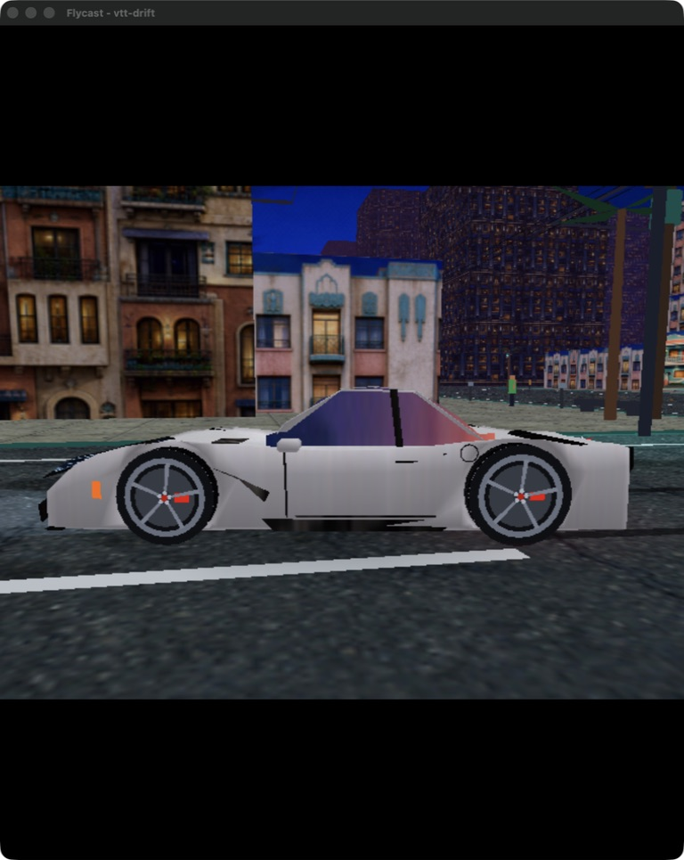 | 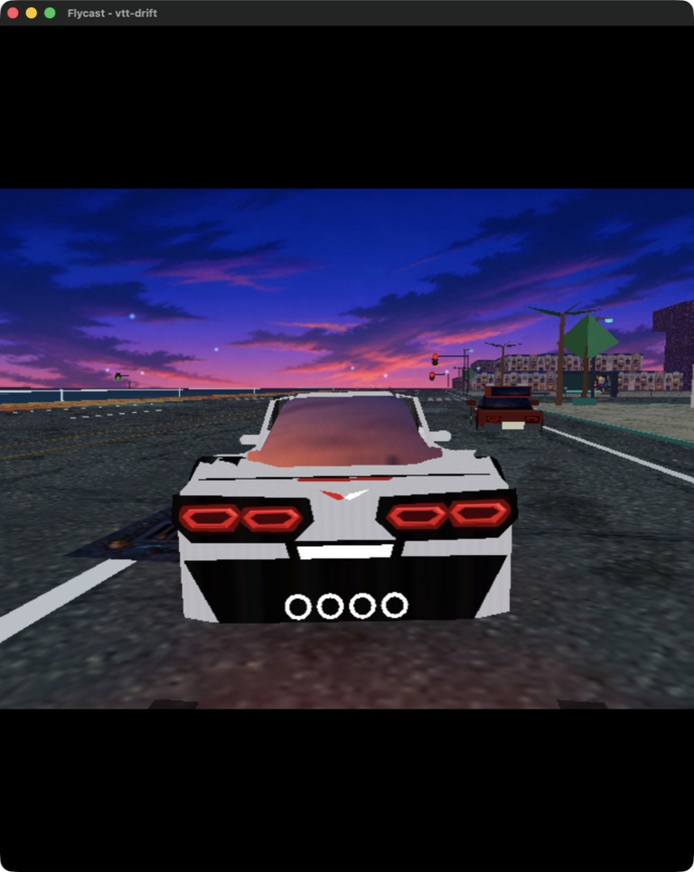 |

At gameplay scale the same model retains its rear identity through traffic and
the full smoke/lighting pass. A separate QA build confirms that all four lamp
cells and the center strip brighten at the rebuilt rear hardpoints:

| Gameplay chase view | Brake-light validation |
| --- | --- |
| 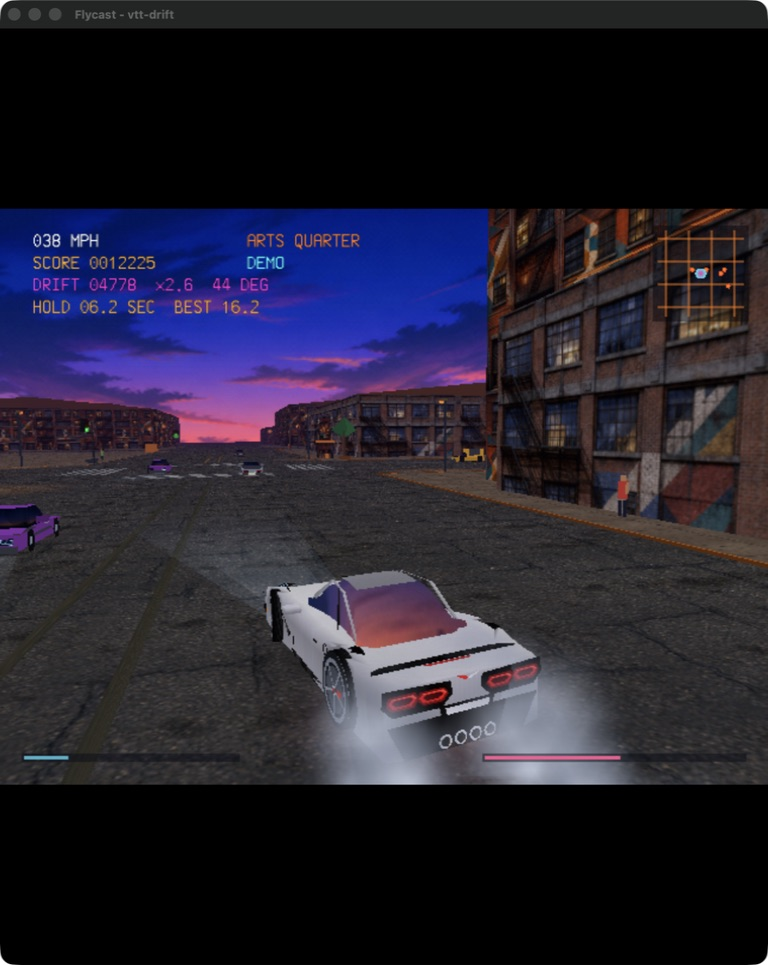 | 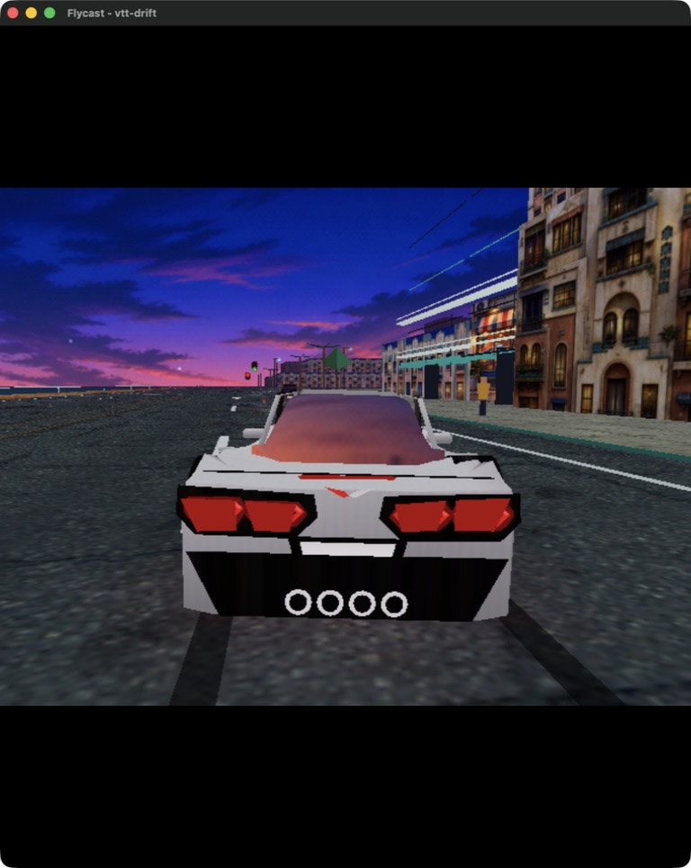 |

The automated tour shortens the pop interval so the intermittent flame is
practical to capture; normal play keeps the wider irregular interval and still
requires strong throttle in the upper RPM band.

## Controls

| Control | Action |
| --- | --- |
| Analog stick or D-pad left/right | Steer |
| R trigger or D-pad up | Accelerate |
| L trigger or D-pad down | Brake / reverse |
| Hold A | Handbrake; rapidly locks the rear tires and pivots the car |
| Tap X with throttle | Clutch kick; dumps a short torque/rev pulse into the rear tires |
| B | Toggle close/wide chase camera |
| Y | Reset to the starting boulevard |
| Start | Pause / resume |

On the title screen, Start or A begins, X launches the automated four-district
demo tour, and B exits. In the demo, Start or A takes control and B returns to
the title. From the pause screen, B returns to the title.

Xbox pads connected through Flycast use a symmetric, dead-zone-corrected analog
response. The serial console prints a one-line `analog LEFT` or `analog RIGHT`
diagnostic whenever the stick crosses the steering threshold, making emulator
mapping problems easy to distinguish from vehicle handling.

## Build

Source the installed KallistiOS environment and run `make`:

```sh
source "$HOME/.local/share/dreamcast/kos/environ.sh"
make
```

This creates `drift-los-angeles.elf`. Verify the target with:

```sh
file drift-los-angeles.elf
sh-elf-readelf -h drift-los-angeles.elf
```

The expected result is a 32-bit, little-endian Renesas SH ELF.

## Run in Flycast

```sh
./run-flycast.sh
```

The launcher builds by default, enables the Flycast serial console transiently,
and boots the ELF by absolute path. Flycast 2.7 on Apple Silicon can
occasionally fail before guest boot with a dynarec `sq_buffer` address-space
assertion. The launcher recognizes only that exact host-side failure and retries
it up to eight times with a short delay; other errors retain their original exit
status. Launch an existing build with:

```sh
./run-flycast.sh --skip-build
```

Set `KOS_ENV` or `FLYCAST_BIN` to override either installed dependency.
Set `FLYCAST_STARTUP_RETRIES` to a positive integer to change the retry limit.

For a hands-off visual tour that changes district every fifteen seconds:

```sh
make showcase
```

The same tour is available from the normal title screen by pressing X.

## Rebuild the textures

The generated C assets are checked in, so the normal Dreamcast build has no
host-side image dependency. After changing a source atlas or the title art,
regenerate the PVR data and local previews with:

```sh
make textures
```

This runs `tools/build_textures.py` with Pillow through `uv`. It crops atlas
quadrants or fits whole-image artwork, downsamples the result, conditions
wrapping edges where appropriate, applies 4x4 ordered dithering, packs RGB565
texels, and emits 32-byte-aligned C arrays. The exact OpenAI ImageGen prompts
are preserved in `assets/PROMPTS.md`.

## Rebuild the audio

The generated engine, tire, and music banks are checked in, so the normal
Dreamcast build does not need a host audio tool. To re-extract the seamless
hardware loops, encode the soundtrack, and write an engine audition WAV:

```sh
make audio
```

`tools/build_audio_assets.py` removes DC, applies equal-power boundary
crossfades, flattens slow circular amplitude envelopes, peak-limits and
normalizes the stationary idle/loaded-rev and tire regions, emits planar 32 kHz
stereo PCM for the AICA, and renders a representative idle-to-redline audition
file. A circular 200 ms loudness test rejects engine loops with more than a
1.15 p95/p05 ratio or a floor below 90% of mean loudness. Source links,
licenses, conversion details, and checksums are recorded in
`assets/source/audio/README.md`.

The same target runs `tools/build_music_asset.py`, which uses macOS
`afconvert` to decode the source Ogg and emits a 22.05 kHz stereo mu-law bank
that the game mixes with two lookup-table decodes per frame. Run `make music`
to rebuild only that bank.

## Regenerate the car mesh

The vehicle is authored procedurally in Blender as a hard-surface lower shell,
separate angular greenhouse, fascia inserts, trim, lamps, and exhaust pieces.
The checked-in generated header keeps Blender out of the normal Dreamcast build:

```sh
make model
```

This runs `tools/build_car_blender.py` in background mode and rewrites
`model_data.h`. To regenerate the header and five orthographic/three-quarter QA
views together:

```sh
blender --background --python tools/build_car_blender.py -- \
  --header model_data.h \
  --preview-dir assets/generated/previews/car-model
```

For an unobstructed in-engine orbit used only for screenshots, build with
`-DDRIFT_LA_SHOWCASE -DDRIFT_LA_CAR_CAPTURE`. This hides the HUD, traffic,
smoke, and flames while keeping the normal city, textures, and PowerVR lighting.

## Hardware notes

Drift Los Angeles uses no emulator-only rendering or host filesystem feature. All
gameplay, geometry, texture data, and HUD resources are embedded in the ELF and
uploaded to Dreamcast VRAM at boot. The renderer uses a fixed nearby-cell budget
and hardware fog to hide the procedural draw boundary. Serial startup and
allocation diagnostics are available through the launcher. On macOS the
launcher disables the nano allocator only for the Flycast child process; this
preserves the contiguous native-memory reservation Flycast needs and avoids the
intermittent pre-boot `sq_buffer` address-space assertion without changing a
persistent emulator or system setting.

## Verified with

- KallistiOS 2.3.0 and SH-4 GCC 15.2.0
- Warning-clean build with `-Wall -Wextra -Wpedantic -Werror`
- Correct 32-bit little-endian Renesas SH ELF header and linked native PowerVR
  scene, primitive, texture, and fog functions
- Direct Flycast 2.7 ELF boot with all textures uploaded and roughly 2.5 MiB of
  PVR texture memory remaining
- Direct PowerVR captures from straight front, exact side, straight rear,
  rear three-quarter, brake-light QA, and the full chase-camera scene
- Repeated four-district showcase cycles with the full traffic, lighting, HUD,
  audio, road, and smoke scene active; the current detailed car pass typically
  registers in roughly 26-32 ms in Flycast, excluding host-side screenshot stalls
- Three simultaneous 32 kHz recorded AICA voices plus the 22.05 kHz effects and
  full-track stereo music stream, with the stream mixer averaging about 3.2 ms
  per service call in the scripted Flycast drive

## Credits

Powered by [KallistiOS](https://kos-docs.dreamcast.wiki/), the independent Sega
Dreamcast SDK. KallistiOS is distributed under its BSD-like KOS license and
requires attribution.

Recorded engine audio uses [“Eight-cylinder engine idling.wav” by
Lumamorph](https://freesound.org/people/Lumamorph/sounds/636066/) under CC BY
4.0 and [“Hot-Rod-V-8-BigSpchg-RoughIdle-RevUps-IdleDR025-30sec.wav” by
Ears68](https://freesound.org/people/Ears68/sounds/144454/) under CC BY 3.0.
The tire recording is [“Distant car tire screetch” by
Sadiquecat](https://freesound.org/people/Sadiquecat/sounds/737192/) under CC0.
Music is [“Pure Raceway” by
MintoDog](https://opengameart.org/content/pure-raceway), released under CC0.
Conversion and loop-processing details are in `assets/source/audio/README.md`.
