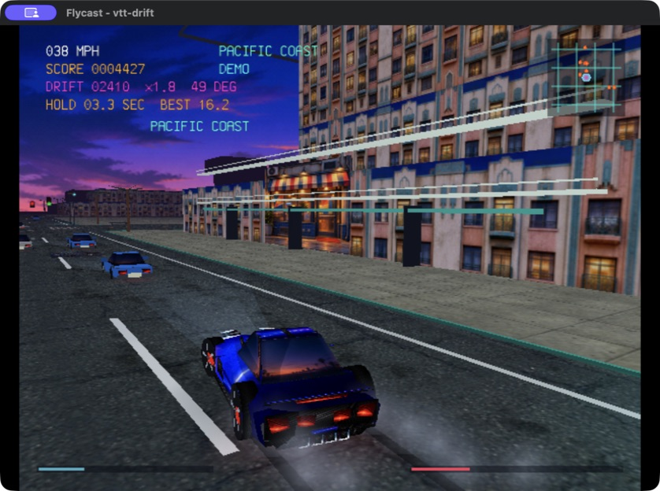
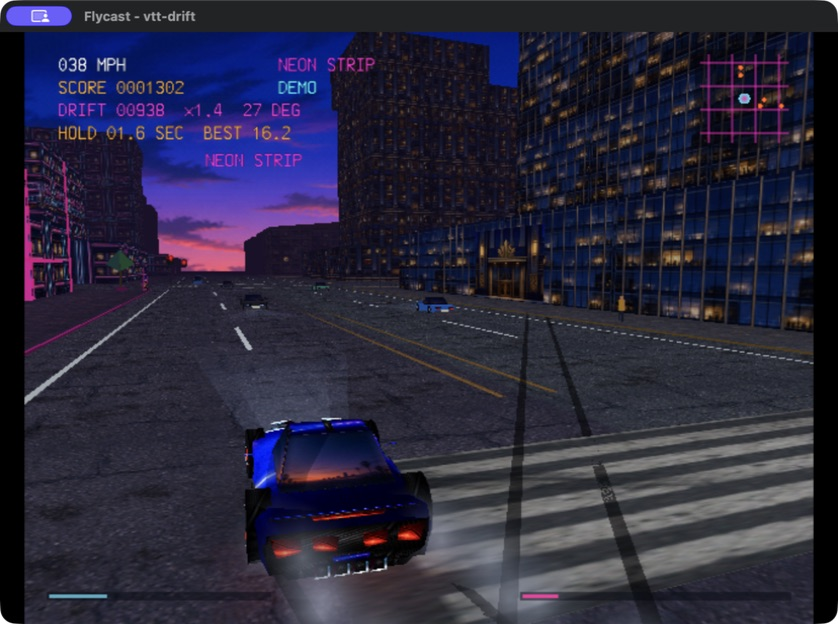

# Drift Los Angeles

Drift Los Angeles is an original open-city street-drifting game built for Sega
Dreamcast with KallistiOS. Drive an original American grand tourer through an
unbounded, deterministic Los Angeles-inspired street grid at blue hour, link
drifts between wide boulevards, and bank increasingly valuable score chains.

The car is an original model influenced by the proportions and angular design
language of the Corvette C7 era: a long hood, fastback glass, rear haunches,
sharp lamps, splitter, diffuser, ducktail, and four separately modeled wheels.
It contains no manufacturer badge or copied production geometry.

## Highlights

- An endless, streamed open city with no world edge or loading screens
- Four distinct neighborhoods, each with its own landmark, lighting, and street
  furniture: Downtown Core, Pacific Coast, Arts Quarter, and Neon Strip
- A detailed C7-inspired coupe with hard-edge normals, baked ambient occlusion,
  view-dependent paint/glass reflections, working lights, steering, and wheels
- Drift physics with throttle oversteer, clutch kicks, handbrake initiation,
  burnouts, and power donuts
- Thirty-six traffic cars that obey lanes and signals, plus pedestrians and
  dense street life
- Modular storefronts, upper floors and cornices with mipmapped architecture
- Blue-hour lighting with soft headlights, oriented tire/contact shadows,
  curved streetlamps and neon
- Detailed palm fronds, dimensional tree crowns, Art Deco roof tiers and
  sawtooth warehouse roofs
- Drift scoring with a six-times chain multiplier, hold timer, and duration
  bonuses
- Long skid marks, layered tire smoke, and high-RPM exhaust flames
- A recorded V8 engine and tire squeal, plus an original three-track outrun
  soundtrack in the style of 1980s synth records
- Compact arcade HUD with a traffic-aware minimap
- Title screen, automated demo tour, pause, and controller hot-plugging

## Screenshots


| Downtown Core | Pacific Coast |
| --- | --- |
|  |  |

| Arts Quarter | Neon Strip |
| --- | --- |
|  |  |

| Layered drift smoke | High-RPM exhaust burst |
| --- | --- |
|  |  |

## Controls

| Control | Action |
| --- | --- |
| Analog stick or D-pad left/right | Steer |
| R trigger or D-pad up | Accelerate |
| L trigger or D-pad down | Brake / reverse |
| Hold R + L together | Brake-standing rear-wheel burnout |
| Full steering lock + R at low speed | Power donut; modulate R to balance its radius |
| Hold A | Handbrake; rapidly locks the rear tires and pivots the car |
| Tap X with throttle | Clutch kick; dumps a short torque/rev pulse into the rear tires |
| B | Toggle close/wide chase camera |
| Y | Reset to the starting boulevard |
| Start | Pause / resume |

On the title screen, Start or A begins, X launches the automated four-district
demo tour, and B exits. In the demo, Start or A takes control and B returns to
the title. From the pause screen, B returns to the title.

## Build

Source the installed KallistiOS environment and run `make`:

```sh
source "$HOME/.local/share/dreamcast/kos/environ.sh"
make
```

This creates `drift-los-angeles.elf`.

## Run in Flycast

```sh
./run-flycast.sh
```

The launcher builds by default. On macOS it uses a connected gamepad, or the
keyboard if none is present, without changing saved Flycast preferences.

Override automatic selection when testing with:

```sh
./run-flycast.sh --input gamepad
./run-flycast.sh --input keyboard
```

Launch an existing build with:

```sh
./run-flycast.sh --skip-build
```

Set `KOS_ENV` or `FLYCAST_BIN` to override either installed dependency.

For a hands-off visual tour that changes district every fifteen seconds:

```sh
make showcase
```

The same tour is available from the normal title screen by pressing X.

## Rebuild the textures

The generated C assets are checked in, so the normal Dreamcast build has no
host-side image dependency. After changing a source atlas or the title art,
regenerate the PVR data and local previews with:

```sh
make textures
```

This needs `uv`. The ImageGen prompts are preserved in `assets/PROMPTS.md`.
The target also rebuilds the reproducible architecture crops and procedural
effect sprites. Run `make architecture` to extract separate upper-wall,
storefront and cornice modules from the source paintings, or `make effects`
to regenerate smoke, contact-shadow and palm alpha sprites independently.
The final converter emits aligned, twiddled 16-bit textures, including
mip levels for selected world materials and ARGB4444 alpha for effect sprites.

## Rebuild the audio

The generated engine, tire, and music banks are checked in, so the normal
build does not need a host audio tool. To rebuild them:

```sh
make audio
```

`make music` rebuilds only the soundtrack: `tools/compose_soundtrack.py`
renders the three songs from their notation, then `tools/build_music_asset.py`
packs them into a 4-bit ADPCM playlist bank (both run through `uv`). Rendered
WAV previews land in `assets/generated/previews/soundtrack/`. Source links and
licenses are recorded in `assets/source/audio/README.md`.

## Regenerate the car mesh

The car is authored procedurally in Blender, and the generated `model_data.h`
is checked in so Blender is not needed for a normal build. To regenerate it:

```sh
make model
```

## QA

`make qa` checks the car mesh and texture inventory, `make qa-run` runs a
60-second district tour with telemetry, and `make physics-qa-run` runs the
burnout and donut regression suite in Flycast.

`make visibility-qa-build` builds `render-visibility-qa.elf`. Boot it in Flycast
or on a Dreamcast and check for `Render visibility QA: PASS`. It reproduces the
turning-camera building disappearance, compares box culling against an
independent corner reference, and checks road selection across signed grid
boundaries.

`make qa-benchmark` records the full district tour, exits Flycast when the
aggregate telemetry arrives, and checks a **30 FPS average** target. The log
and JSON report are saved to `assets/generated/previews/visual-qa/benchmark.log`
and `benchmark.log.json`; override the log location with `QA_LOG=/path/to/run.log`.
The average uses rendered frame count divided by real elapsed time, including
frame waits and audio work. Periodic PVR FPS and registration-time samples are
reported separately. Emulator results do not establish real-hardware performance.

An existing log can be checked with:

```sh
uv run tools/analyze_render_log.py /path/to/run.log
```

The parser requires aggregate telemetry and at least 30 measured seconds;
older logs containing only FPS samples cannot establish a whole-run average.
`make qa-tools` runs regression checks for the log parser, mesh audit and
PowerVR texture/mipmap packing.

Texture bytes are an inventory rather than a fixed 4 MiB allowance: the
Dreamcast's 8 MiB VRAM also holds framebuffers, vertex buffers and tile bins.
The benchmark reports successful resident allocations and remaining VRAM.

The September 2026 graphics upgrade completed the 60-second four-district
Flycast tour at **32.00 FPS average** (1,922 frames / 60.062 seconds), compared
with 27.20 FPS before the upgrade under the same host configuration. This is
an average target, not a locked minimum: individual sampled intervals can
fall below 30 FPS. Textures and HUD occupy 3,965,248 bytes (3.78 MiB), with
1,144,648 bytes (1.09 MiB) free after PVR allocations and a 768 KiB vertex
buffer. The benchmark kept game audio synthesis enabled and used Flycast's
null host-audio backend. Real Dreamcast hardware remains to be measured.

Vertex-count telemetry gives a lower bound on stream bytes; polygon headers
also consume the PVR vertex buffer. The mesh audit checks the renderer's
4,096-vertex and 4,096-face limits after UV/normal/material splits, welded
body proportions, noncollapsed texture UVs, atlas bounds, AO values and
material face ranges. Each material has separate vertices for cached shading.

## SH4 rendering acceleration

The renderer uses pinned, vendored [SH4ZAM](https://sh4zam.com/) headers for
batched camera transforms, positive-depth reciprocals, reflection normalization
and paired sine/cosine. No extra SDK installation is required. The car's draw
cache keeps each vertex's frequently used fields together on SH4 cache lines.
Vertices now go straight to PowerVR through the store queues, and the car shades
only vertices referenced by front-facing faces. Wheel transforms reuse their
rotation pairs, and fixed scene colors are folded at their call sites. These
changes and the visibility corrections give a **47.97 FPS** four-district tour
in Flycast with the upgraded artwork and unchanged VRAM allocations. See [PERFORMANCE.md](PERFORMANCE.md)
for the measurements, limits and reproducible checks.

Build the standalone numerical checks with `make math-qa-build`, then boot
`render-math-qa.elf` in Flycast or on a Dreamcast. It prints maximum errors and
`Render math QA: PASS` to the serial console. Run `make physics-qa-run` and
`make qa-benchmark` for the driving regression and full graphics tour.

`make geometry-qa-run` runs the tour with a fixed 30 Hz simulation step and
prints whole-tour triangle/vertex totals. Compare two captured logs with
`uv run tools/compare_geometry_logs.py before.log after.log`. This checks
geometry counts independently of renderer throughput; it does not measure FPS
or compare pixel colors. For a submission-path comparison, clean and add
`-DDRIFT_LA_STAGED_SUBMISSION` to the geometry QA CFLAGS. Rebuild without QA
defines to return to normal play.

## Credits

Powered by [KallistiOS](https://kos-docs.dreamcast.wiki/), the independent Sega
Dreamcast SDK. KallistiOS is distributed under its BSD-like KOS license and
requires attribution.

Recorded engine audio uses [“Eight-cylinder engine idling.wav” by
Lumamorph](https://freesound.org/people/Lumamorph/sounds/636066/) under CC BY
4.0 and [“Hot-Rod-V-8-BigSpchg-RoughIdle-RevUps-IdleDR025-30sec.wav” by
Ears68](https://freesound.org/people/Ears68/sounds/144454/) under CC BY 3.0.
The tire recording is [“Distant car tire screetch” by
Sadiquecat](https://freesound.org/people/Sadiquecat/sounds/737192/) under CC0.
The soundtrack (“Blue Hour Boulevard”, “Pacific Coast Highway” and “Neon
Strip”) is original to this project, composed and synthesized in
`tools/compose_soundtrack.py`.
Conversion and loop-processing details are in `assets/source/audio/README.md`.
